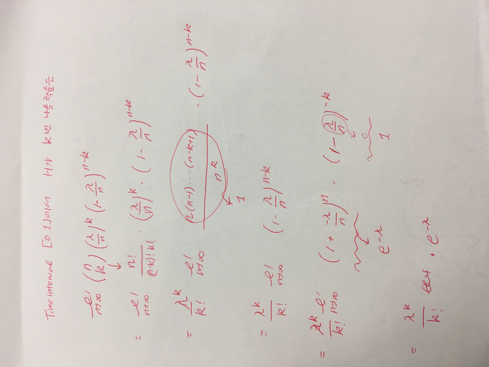

# 2017-09-25-Computer-Networks~2017-10-11

## Socket Interface

### Client-Server Model 

### Sockets need addresses

소켓은 서로 다른 host가 다양한 서비스를 제공하도록 해줌!
먼저 서버의 location을 알아야함. ( IP addr) 
한 서버는 다양한 service를 제공할 수 있음 
-> 이 서비스를 port number로 구분해줌 

16bit number라서 0부터 65535까지 있음

Incoming request를 번역해서 port # 로 보내줌. 
근데 열려있는 port가 없으면 transport layer에서 reject함

multiplexing(layer 를 타고 내려가는) 하는 역할을 하는게 port #

### Client function

* Connect function : 소켓 / 소켓주소 / 주소 길이)
server에 Request 하는 거와 같음 -> initiating phone call 
성공하거나 error! 
Error 경우 : 서버가 응답이 없거나 / connection을 거부했거나 (wrong info packet이어서 잘못 도착했거나..) 

### Server Function

* Bind (socket / socket 주소 / 주소 길이)
서버 소켓을 IP addr + 특정 port # 에 할당하는 거 

* Listen(소켓 / backlog)
이 소켓을 server socket으로 활성화하고 대기 상태로 들어가겠다. 

* Accept
Connect func이 이걸로 accept

- - - -

### Common function
서버클라이언트 상관없이! 
* socket : 소켓 생성
* send : 데이터 전송
* recv : 데이터 받기
Blocking op. 할수도 있고 안할수도있고 mode를 set할수있음.

### Flow diagram

Accept  다음에는 loop

client는 왜 bind를 안하나? 할수도있지만 그렇게 포트 #  중요하지않아서. 

## IP addr
4 digit : 32bit(4byte) 
각각 0~255 이고 전체는 4G개 정도 됨.

집에서는
NAT(Network Address Transmission service..?) 
192.168.1.1(내부 주소, IP sharing할 수 있음)
그래서 IPv4지만 딱히 모자르지는 않음 

사실 집으로 들어오는 주소 조차도 IP 회사에서의 가상 주소임 

IoT  / 5G 같은거 생각하면 devices가 너무 많으니까 
IPv6생각해야할 것

127.0.0.1 localhost
내가 나한테 package 보낼때는 localhost 사용함. 스스로 socket열어야하구..

- - - -

## socket address structure

# 2017-09-26-Computer Networks
10/13 프로그래밍 과제 10:00pm
C파일만 accepted..! 
Virtual Box에 ubuntu깔아서 하기 

## Multiple Access
한사람이 말하면 들을수있지만 여러명이 말하면 겹쳐부림

해결법
1. Moderator : modertator가 너 말해도 돼 하기를 기다리기
그런데 moderator와의 connection이 끊기면?
2. Distributed solution
: 말하는 사람 없으면 말해라

##  Contexts for the multiple access problem
* Shared transmission medium
: 무조건 broadcast임
* collision
: 여러 msg가 동시에 여러개 

## LAN
:물리적으로 가까운 곳에서 일어남 
-> shared medium (유선랜)사용 -> multiple access 문제 해결해야함

## Techs 
읽어보기 

## Solving the problem
1. Bash tech를 고름 
2. Multiple access tech를 고름

## Packet Multiple access
: 원하면 보내주는 방식(on-demand) 
1. Central  -> moderator 존재
2. Distributed -> 사람들이 각각 경쟁함

1. Polling
모두에게 물어보는 방식
2. Scheduling
: 시간이나 주파수를 할당하는 방식 
3. Random access
: 무작위로!
Ex) ALOHA Protocol
뭔갈 보내고 싶으면 보내기
Collision 없으면 성공, 있으면 -> random time 동안 기다린 다음 재전송 (`random backoff scheme`)

* Slotted ALOHA
Original ALOHA에 비해 두배 효율이 좋음 

## Collisions in packet  radio networks 
Interference from other transmission이면 collision일어나게 됨 
Intended receiver가 아니어도 여러 packet을 들을수 있으면! 그 들은 receiver가 collision이 생기게 됨

- - - -
ALOHA에서는 
모두가 서로 들을수있다고 가정(every node is in broadcast situation)

12~2시까지 수업함
-

## Performance Analysis
We will look at some random variables 
1. Bernoulli RV
2. Binomial RV 
3. Poisson RV

### Bernoulli RV
변수 X에서 
P(X=1) 를 p라고 함. P(X=0)은 1-p에 해당함. (X가 0과 1로 결정됨)

 

### Binomial RV
X가 이항분포(nap)를 따를 떄 

P(X=k) = nCk (p^k)((1-p)^(n-k))

X는 0부터 n까지.

### Poisson RV

λ는 X의 평균(기대값)
X=k일 확률이 ~이면 possion을 따른다고 말함 
e는 자연상수
이항분포의 특별한 형태기도 함 
다음과 같은 확률적인 문제를 알아내기 위해 쓰이고 있다.

어떤 시간 동안 톨게이트를 통과하는 차량의 수
어떤 페이지 하나를 완성하는 데 발생하는 오타의 발생률
X가 독립적이어야함

-
시간 축을 n개의 timeslot으로 나눈다고 하자. 
각 timeslot 마다 한번씩 동전던지기를 해서 총 n번을 던질거고. 
P(‘H’) =  람다 / n
P( k개의 ‘H’가 나올 확률) -> Binomial 분포를 따름 X~ B(n,람다/n)
-> (n k) ((람다 / n)^k ) (1-(람다/n))^(n-k)

Binomial일때 E(x)는 np이므로 여기서 n*람다/n =  람다 

n가 무한으로 갈때 H가 나올 확률은 0 이야 

-
Time interval [0,1]에서 H가 k번나올 확률을 n-> infinity할때 

 Suppose the number of flipping ‘H’ during time interval [0,1] is distributed ~Poisson(λ)
•  What is the distribution of the number of flipping ‘H’during time interval [0,t]?
•  Answer:~Poisson(λt)

## Performance of ALOHA
G가 load -> 단위 시간동안 전송시도된 packet 평균 개수 
Time interval 동안 시도된 전송 횟수가 t라고 하면 
Poisson(Gt) 을 따름 

S(G) = throughput = S(G)는 단위 시간동안 전송 성공한 packet)

protocol의 capacity라는건 S(G)의 maximum value (ideal case)

-
###  Some Exercise on Poisson Distribution
Packet전송
첫번째 예제
->  X=1 (user수가 1.) (X=k)

두번째
->   X =0 (X=k)

세번째 
-> some users 도착할 확률 =  1- P(아무도 안올 확률)
아무도 안올 확률 
infinitesimal한 timeinterval에서는 user가 1명이 오거나 아무도 안오는 경우밖에 없음.  

-

### Performance of ALOHA

S = G * 성공할확률 = G * 두 time unit동안 transmission이 없을 확률 = G * e^(-2G)

### Slotted Aloha Performance 

Slotted Aloha의 문제점
Preventive measure 가 없음 
Collision 처리가 늦음 

어케 잘하쥬? 

-> 
## CSMA 
Channel sensing하고 있다가 아무도 안하고 있으면 보냄 
(Listen before you talk!)

