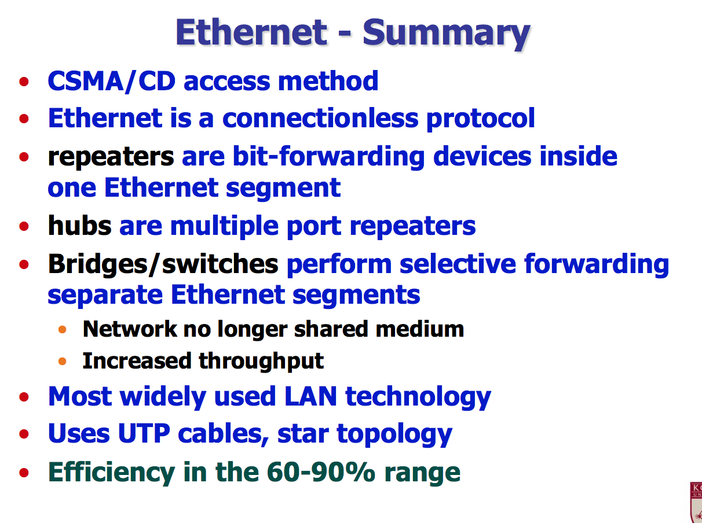
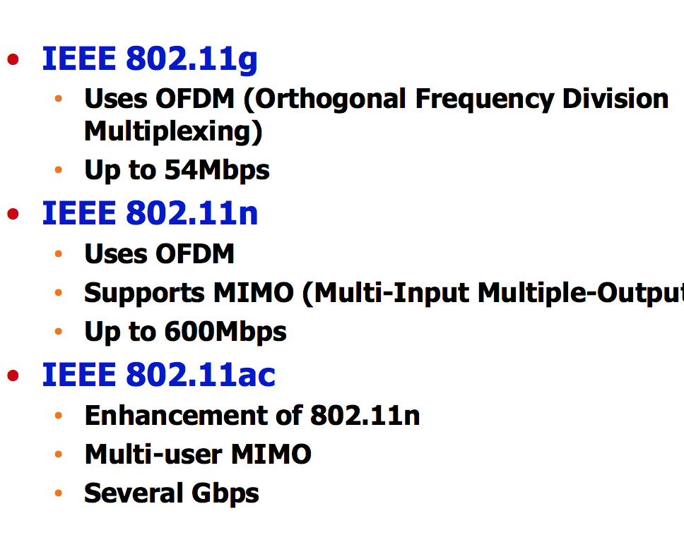
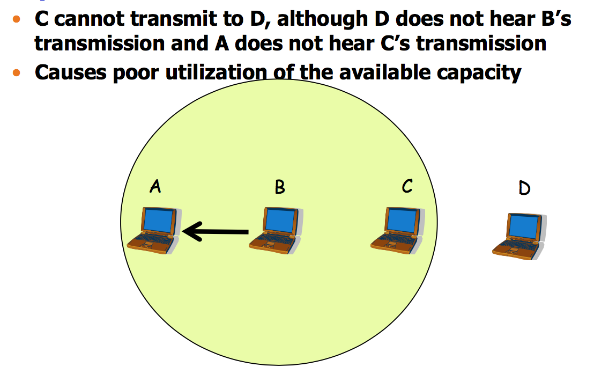
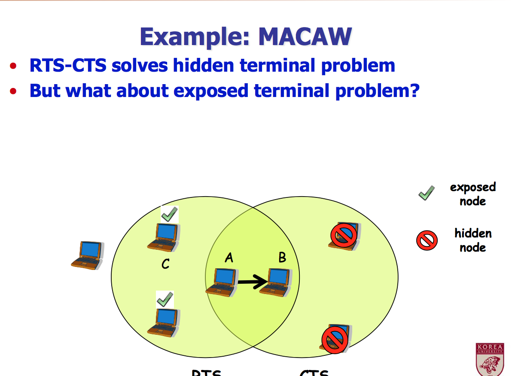
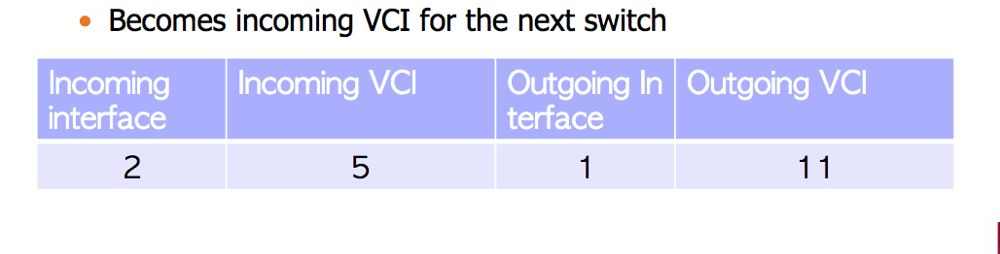
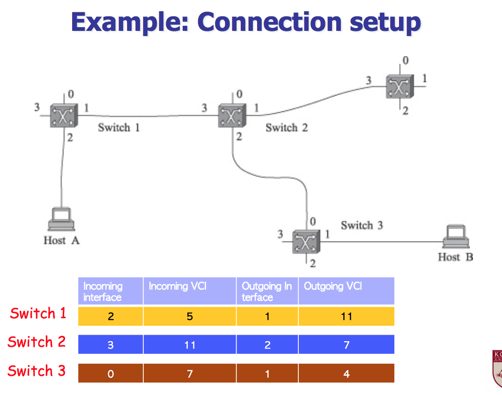

# 2017-10-18-Computer Networks
그 전에 갔다와서 CDMA-CD 제대로 모름

##  Performance of CSMA/CD - efficiency

##  Physical Layer - 10BASE-T
 To TX packet
•  Copy packet to buffer in network interface, and wait
until incoming link is idle
•  Encoding ensures transitions on each bit interval -> Rxer uses transitions to detect bits

To RX packet
•  Acquire synchronization
•  Store bits in buffer and inform computer when packet received

##  Ethernet Frame Structure
IP datagram이든 upper layer의 것을 encapsulates함

여기서의 Dst addr와 Src addr는 ethernet addr를 의미함

Preamble의 정해진 패턴을 맞춰야지만 recognize할 수 있음

CRC에 계산된 숫자가 아닌 random한 숫자를 붙이면 바로 drop하게 되어있음 -> jam 이 작동하는 방식

## Repeaters Increase Span
repeater는 signal을 받아서 amplify함
2-port repeater
1. 하나에서 다른걸로 bits 복사 (sharp / clear한 signal 나옴)
2. Collision 이 감지되면, 다른 port에 random bit를 반복

## Hub
위에거는 2way를 copy하는 거지만
여기는 multiple ways copy
들어오는 port를 받아서 모든 outgoing port에 복사-전송해줌

-
이더넷 허브는 star topology를 씀
옛날건 bus씀

### 한계
Increase span하지만
모든 노드가 Single collision domain이라
한 노드만 전송할 수 있음 특정 시간에

## Bridge and Switches
bridge는 다른 이더넷 세그먼트를 연결하는 애( layer 2)
서로 다른 네트워크를 연결 ~.~

들어오는 패킷을 선택적으로 골라서 나가는 포트로 전송함
(Layer 2의 주소를 보느냐 아니냐. hub는 주소에 상관없이 막 보내고,
switch는 해당 레이어 주소만 보냄)

Switch는 multiport bridge임

## Hub vs Switch
hub랑 repeater에 연결된 애들은 half-duplex
Half-duplex -> Tx/RX 둘중 하나만. 부딪히면 collision
Layer 1에서 일함
Multi-port repeater임
쌈
overhead큼 (너무 겹치는 packet많음)

bridge /switch 에 바로 연결된 stations들은 full duplex고
Full-duplex -> Tx/RX 따로  
Multi-port bridge임
Layer 2
요즘엔 쌈
overhead적음
Collision 덜 남

## Switch : traffic isolation
switch가 여러 hub와 연결될 수 있음
이 hub들은 또 여러 node와 연결
이 hub연결된 node들 끼리는 동시 전송 ㄴㄴ
이 domina을 one single collision domain이라구함

switch는 여기에 split을 제공해서
Collision domain을 쪼갠거임
그래서 다른 c.d에 있는 애들은 동시에 전송이 가능함

## 급 Ethernet Summary로 넘어감

## CSMA -CA
이제 carrier를 sense할 수 있음.
말하기 전에 듣는!
근데! collision을 다룰 때는 좀 다름
이제 나오는 collision을 피하려구함 ~ 그리고 detection이 어려운 상황이 있음
Collision dectection이 더 좋지만  >  그게 안되는 경우 CA를 씀

그래서 ethernet에서 CD를 씀
wireless에서는 CSMA/CA가 더 적당

## IEEE 802.11 : wi-fi
1) AP사용하는 법 -> Access Point 에 먼저 연결 -> AP는  이더넷을 사용해서 보통 인터넷과 연결 되어있음

2) AP없이 Ad-hoc으로 연결되어있는 경우도 있음.

## wifi의 physical layer
원래 802.11이 802.11b로 확장됨
2.4GHz의 Unlicensed spectrum -> spectrum은 다 돈임. 근데 돈 안내고 쓸수있는 unlicensed spectrum이 있고 이걸 사용 -> microwave도 ..?

DSSS  (Direct Sequence Spread Spectrum)

1. 각 비트마다  n개의 random bit와 XOR한 결과를 보냄
2. 이 n개의 random sequence는 보내는 사람 / 받는 사람 둘다 알고 있음
3. N-bit chipping code라고 부름

## 802.11 향상된 버전들

OFDM : 4G가 사용중임.
-
MIMO : multiple access를 지원한다는 뜻
-
802.11ac
너무많이 고쳐서 두개씩 붙이기 시작함
Gbps 까지 지원

## 왜 WirelessLAN에서 CSMA/CD 안함?

내가 보내는 동안 뭐가 오는지 들을수있어야함
transmiitter가 바로 collision을 감지할수있어야함
-> wireless lan에서 어려움

wireless가 동시에 transmit과 receive를 동시에 해야함
-> 불가능한건아닌데 비쌈

즉 무선과 유선의 차이가
Wired case면  따로따로 Tx와 Rx 선을 만들면 됨

wire-less면.. 예를 들어 Tx와 Rx를 보내는 안테나가 다르다고 하자
Transmission하면 바로 옆에 있는 rx안테나가 받아버림
바로 옆이라 너무 큰 신호라서 멀리에서 받는 weak one을 받을 수가 없음
물론 내가 보내는 거니까 이걸 cancel할 수 있지만( full-duplex radio: 최신 기술)
지금은 비쌈!

그리고
sender들이 너무 멀리 떨어져있어서 이 채널이 idle이라고 생각하고 보내버릴 수 있음 -> detect collision할수가 없음

##  CSMA/CA in 802.11 WLAN
•  It’s too late to detect and resolve collision, so why don’t we avoid it first
•  There are two problems in wireless networks

1. Hidden node problem
2. Exposed node problem

## Hidden Node Problem
Signal 출력때문에 다른 노드의 전송이 `hidden` 되는 현상

## Exposed Node Problem

보낼수 있음에도 다른 방향으로의 TX가 감지되어서 못보내는 현상

# 171023
Exposed node 계속
Two concurrent 가 가능하지만 tx가 감지되어서 못보내는 현상

이런 Hidden Node Problem과 Exposed Node를
802.11가 어케 해결함?
(시험볼때 자주나온다그함)

* MACA
마카~
Multiple Access with Collision Avoidance
MACAW로 업그레이드됨
Hidden node problem을 해결함

어떻게?
-> Extra packet을 보냄(control packet)
Data exchange packet을 보내기 전에!
그래서 channel을 reserve함

## MACAW Control msg
* RTS
Request to send
-> data를 포함한건 아니고, 보내는 사람이 주변 노드에 이제 tx할거라고 말함
-> RTS를 들은 node들은 특정 시간동안 tx못함
* CTS
-> receiver가 주변 노드에 나 데이터 받을거라그함
-> CTS를 들은 node들은 특정시간동안 tx못함
* ACK
-> Receiver가 Transmitter에게 data잘 받았다고 말함
-> ack를 들은 노드들은 그때부터 tx보낼수있음

-

A로부터의 exposed와 hidden node
-

pdf에 나온 순서대로 하면
Hidden node problem은 해결하는데
exposed는 해결이 안됨
-> 그래서 if RTS를 들었지만 CTS를 안들었으면 전송할수있게 함  (해-결)
그런데
 802.11 에서는 이 문제 걍 해결안함(복잡하고 비용많이 드니까)

## CSMA in IEEE 802.11
CSMA는 carrier 가 감지되면 channel이 busy -> stay slient하는거

* physical carrier sense
-> physically signal의 strength 감지함
* virtual carrier sense
-> RTS/CTS 메커니즘에 의존해서 channel이 바쁜지 감지함

### Virtual Carrier sense
* NAV(Network Allocation Vector)
채널이 빌 때까지 얼마나 남았나
* RTS/CTS 보낼 때 Tx time이 들어있음
그래서 RTS/CTS를 듣는 노드들은 자신의 NAV를 조절하게 됨
시간에 따라 당연히 감소하고
NAV가 0이 되기 전까지는 전송할수없음

* Power save할 수 있을 지도

-

Simulation diagram에서

rts나 cts가 2 timeslot이 지났다고 생각해면됨

## IEEE 802.11 Wireless MAC
MACAW가 binary exponential backoff로 사용됨 -> collision막으려고

하지만 collision이 다음 경우에 여전히 생길수있음
* packet이상
* RTS/ CTS 패킷끼리 (짧아서 거의 안생기지만 생기긴함)
* node가 움직이기때문에!( mobility)

### Service Model

* PCF

* DCF
보내고자하는 node가 one-hop에 안될수있음
가까운데 보내고 -> relay packet함 -이걸 multi-hop이라구함

-
### Modes
* Infrastructure
-> wifi쓰는것처럼 AP가 있어서 connection하는고
주변에 있는 friends에 보낼수없음

최근 AP는 DCF씀

-> senses channel
-> channel이 바쁘면 random time기다렸다가 다시 감지
-> 요건 weak form of collision avoidance임
-> 안바쁘면 data보냄
-> wifi검색은 -> wifi AP를 검색하는거
-> 받는애는 데이터 받았을때만 ACK를 보내쥼
-> (sense) - Data - ACK

* Ad-hoc
-> equal
-> channel resource를 아무나 쓸수있고
-> 그래서 collision일어날 가능성 많아효
-> RTS/CTS쓰면
(Sense) rts-cts-data-ack
-> 더 강한 버전의 collision avoidance

-

# WLAN
CSMA/CA
CSMA/CD
-

# Switching
Programming assignment #2 나옴
-

Multi-input port / multi-output port

End system 연결하고 서로서로 연결함
Input이 들어오면 최소 하나 이상의 output port로 연결해야 함

1) hub처럼 안전하게 모든 방향으로  broadcast하는 경우도 있음

## Classification
Packet switching을 emulate해서 circuit switching처럼 쓸 수 있음
그래서 virtual circuit 한 방법으로 ~.~

## Virtual Circuit
Connection -oriented model이지만 여전히 packet switching임

Data transaction을 하기 전에 setup단계가 필요함 - 끝나고 는 teardown필요함

Control plane
-> connection path를 찾고 + setup을하는  protocol function들의 집합

Data plane
-> 실제로 data packet을 운반하고 forwarding하는 protocol function들의 집합

### signaling protocol
Call-request data를 보냄
Call -accepted / rejected 가능한데

accepted되면 길을 맨들어주고 setup 함  - 다 끝나면 teardown도 하고
Virtual circuit에 참여할 router들이 다 정해진 거

ex) ATM / frame-relay, X.25

각각 packet은 VC identifier있음
-

## Vc connection setup
path에 있는 각 switch는
Incoming Interface(port #) , Incoming VCI, Outgoing interface, outgoing VCI 로 이루어진 VC table(state) 를 만듦.

만약 2번 port로 들어오는 id가 5인 애를 보면 이 packet을 1번포트로 보내면서 label을 11번으로 바꿔주세요~.~ 라는 뜻

Host A에서 B로 가려면
라우터를 3개 가야함

어떻게 forwarding을 하는 건가 알려주는 표 ~.~

## Datagram Switching
쭉 읽어봐요

## Ethernet Switches
Learning bridges

Forwarding table을 구축하는 방법
1. 모든 port에 오는 모든 packet을 받는다
2. DA(Dat Adrr) entry가 table에 있으면 포워딩
3. 없으면 모든 다른 포트로 넣음(flooding)
4. SA(Src adds) entry가 없으면, SA/port에 관한 엔트리를 만듦

이 table은
cache에 가까움
Possible changes의  대비하기 위해서
