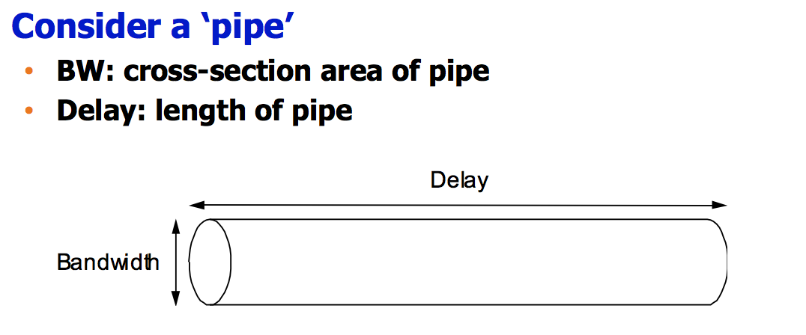
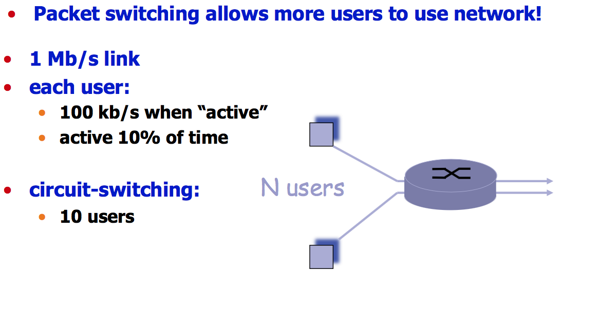
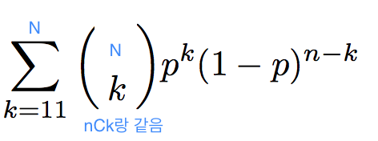

# 2017_09_13_Computer_Networks
##  Delay-Bandwidth Product
말 그대로 Delay랑 Bandwidth 곱하는 거 

Delay가 D라고 하자 (sec)
bandwidth가 B( bits/sec)이라고 하자 
B* D = bits가 나옴  -> 즉 volume of information 



이 겹치는 부분은 cross-section area이고 이걸 bandwidth로! 

D라는 시간 뒤에는 이 pipe가 bits로 가득차고, 처음 bit이 목적지에 도착하게 됨 
그러면 B*D는 pipe를 채울 수 있는 bits의 volume임

왕복은 2D가 걸린다! 그러니 에러메시지가 도착하는것도 2D 뒤에 알게 됨
그러면 내가 낭비한 information은 얼마인가? 
> B* 2D   


## Example
•  Ex) In 1980s, trans-continental channel, bandwidth: 45Mbps, one-way delay of 50ms
•  (50 x 10^-3) sec x (45 x 10^6) bits/sec = 2.25 Mbits
즉 한번에 보내는 정보량이 2.25Mbits 

•  Why is this important?
•  Large delay-bandwidth product 
•  Satellite
•  Trans-continental fiber links

##  Delay and Bandwidth
delay와 bandwidth 는 독립적인 지표임. 
뭐가 더 중요한가?
-> 어플리케이션에 따라 다름
* voice calls : delay가 중요함
interactive하기때문에
* Youtube HD : bandwidth 가 중요함 
bandwidth가 면적이라서 한번에 얼마나 frame이 들어올수있는지, resolution을 결정하기 때문에! 

### Important concept of Quality of Service (QoS)


##  Revisit: Circuit vs Packet switching


> 문제조건  
(Deactivated)0-1(activate)
traffic이 user마다 다를 수 있음
* 각 유저가 활성화되었을 땐 100kb/s 의 대역폭을 사용함 
* 평균적으로 전체 시간의 10%를 사용한다구 함

1. Circuit switching을 사용한다고 하자
몇명의 user를 감당할 수 있나?
각 유저에 대해서 고정된 bandwidth를 할당해야하니까 
1mbps / 100kbps = 10 
> 10명   
물론 각각 90%의 시간동안은 idle이어서 낭비되지만.


2. Packet Switching 
특정한 시점에 activate된 user의 수 에 따라서 더 많은 user를 수용할 수 있음
통계적으로 접근해보자.
```
어떤 시점에 한 user가 active된 확률은 0.1임
deactive될 확률은 0.9
모두 독립사건이라고 가정하자 

N user가 있을때 overflow될 확률은 
특정 시점에 10명 이상이 동시에 on일 확률과 같고 

이 distribution은 B(N,0.1)인 이항분포를 따름.
```

즉 N user가 있을때 overflow될 확률은 


이렇게 계산할 때 35명이 하면 overflow확률이 0.004 이하임
비행기 overbooking예제
100명 정원인데도 105명이나 110명을 받음
그만큼의 사람들이 타지 않기때문에!

## 그러면 패킷스위칭이 항상 좋은가?
* store-and-forward 상의 문제 
`Delay` `Loss`
Unfair situation이 생김
모두가 maximum speed로 쓰려고하면 인터넷을 쓸 수가 없음! 
그래서 regulation을 두고 인터넷을 사용하게 됨. 
regulation이 없으면 go mad 됨 (이기적인 개인 가정)
* 장단점 있음


##   Packet-switched networks: forwarding

두가지로 나눌 수 있음

1. Datagram network
2. Virtual circuit network
* 가짜로 만들어서 circuit switching처럼 쓰는 거. 
* packet으로 circuit을 흉내낼순 있지만 반대로는 불가능함.


## Datagram


