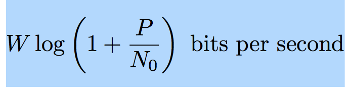
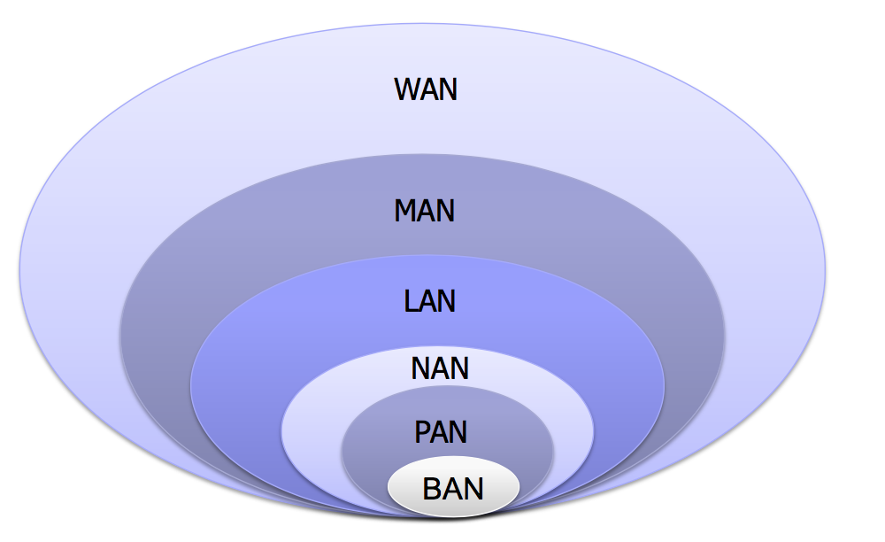
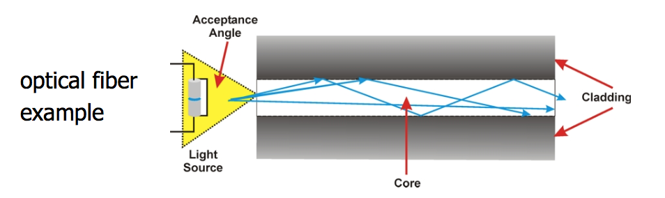
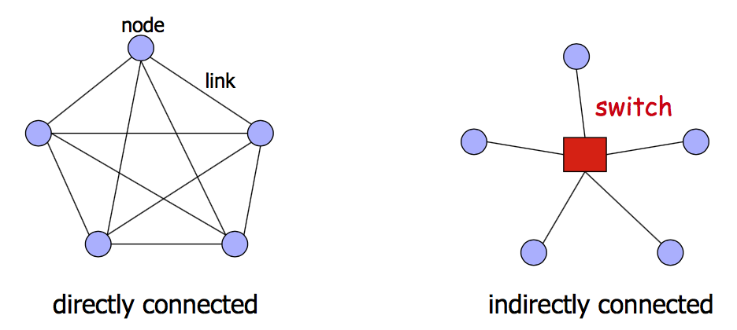

# Computer Networks 170906
개굿

월요일 : 1시간 15분 
수요일 : 1시간 15분 으로 바꾸시고 
정원 134=> 150 로 늘리심

## 우리가 information을 얼마나 전달할 수 있나?
1 to 1 communication 
받은 power가 P, 대역폭이 W, noise power가 N이라고 하자 
P가 크면 더 info를 많이.
N이 크면 info가 적게 되는게 당연.
P vs N 의 관계~.~

**단위 시간동안 얼마나 bits를 전달할 수 있는가?**
를 `inforamtion capacity` 라고함. 
Maximum amount of information can be delivered ( in this context)

### Clause Shannon 
정보이론의 아부지 

이것 이상 전달할 수 없음. 
P가 클 수록 당연히 많이 전달. N이 클수록 less information 
Relative concept~.~
log함수이기때문에 그렇게 빨리 증가하진 않음. 

### Current state of the art 
최신의 기술로는 point-to-point 통신에서는 전달할 수 있는 limit에 이미 도달했다.
coding과 MIMO와 information theory 덕분에 fundamental limit에 도달한거  
MIMO (multi input, multi output) : 안테나 여러개를 사용해서 전달하는거

### 그러면  1: N 이나 N:N은?

두 entity이상인 경우가 많음. 이런 setting을 이해하기 위해서는
Network information theory가 필요.
Network coding이 필요. 
Network MIMO 가 필요. 

훨씬 어렵고, 연구가 진행되고 있음.

### Network and geographical locality
네트워크의 성능은 locality에 의존함
즉 얼마나 상대 entity와 멀리있느냐!

Transmitter가 receiver가 전달하는 경우 
1. 가까울 때
* 가까운 사람이 더 louder message를 받는 거는 명백함.
* R이 받는 Power Pr은  
2. 멀 때 
* 같은 강도로 얘기한다고해도 이 사람이 더 적게 받는 건 명백함. 
* R’이 받는 Power Pr’ 보다 크다. 

`coverage area`  의 크기에 따라서 
network를 나눌 수 있음. 

### Networks based on physical coverage

#### BAN 
~2m정도
제일 작음 (Body - ) . 사람 몸 크기 정도만 커버하는 거 
Ex) 모션센서, oxygen sensors. 심장질환이 있는 사람에게 쓰는 pace maker 같은거. Irregular mvmt of heart 를 기록하는 cardiac sensors
요즘엔 wireless로 하고 있음 
Small power! 이런 디바이스에서 power가 중요한데, pacemaker가 멈추면 심장이 멈춰버리니까;;;
또한 무선충전으로 외부에서 배터리에서 충전하는 것도 있음

#### PAN : 
Personal. ~10s meters
집안에서 사용함 
Ex) 무선 키보드 / 마우스 / 펜슬 /bluetooth / 무선 usb 등 
Office env에서 사용되곤 함 

#### NAN : Neighborhood
100미터~몇km 정도 
잘 안쓰임
Green IT나 Smart Grid
전기계량기! Power meter info를 얻기 위해서 모든 집을 방문할 필요 없음 
Power industry + IT 를 합쳐서 Smart Grids를 만듦

#### LAN
보통 communication에서는 LAN을 제일 자주들어봄.
랜선! ethernet해서~~~
100s 미터~ 몇 km 정도 
Ex) 학교 캠퍼스 / 회사 / 병원 에서 사용, / 
router에 케이블로 연결하기도 하고 
wireless인 경우 wifi가 되기도함
**Ethernet**(IEEE802.11) 과 Wifi
: 우리 생활속에 제일 기본적이고 많이 퍼진 기술

Bluetooth : PAN
Ethernet / Wifi : LAN
4G / LTE / cellular : WAN 

#### MAN
Metropolitan
많이 안함

#### WAN
Wide Area Networks
: 나라 전체 / 세계 
* wired
: SONET(Fiber),AsynchronousTransferMode,Frame Relay
* wireless
: 3G / 4G / (5G는 표준화가 안됨) / 

# Lecture 1
* Communication Network가 뭔가?
* Switching
• Multiplexing
• Performance metrics
• Classification of switching networks

## Communication Network가 뭔가?
Communication : 정보교환하는거 
Communication Network : 둘 이상의 entities 가 information exchange하는 것 

###  Two elements of networking
1. Node
* 정보를 가지고 있고, 처리하는 실제 entity. 
* 보통은 computer임. 폰이거나 laptop이거나..서버이거나.

2. Link
* 노드를 연결하는 물리적인 매체 
* wireless는 공기ㅋㅋㅋㅋ 그냥 전자기파를 쏘는 거라서. 
* 어떻게 node들이 연결되었는지에 대한 방식을 `topology` 라고 함
수학에서는 `위상`! 
Multiple access 위상에서는 하나의 shared link가 있음.
 
#### Link 기술 
* twisted pair
랜케이블. induction을 줄이려고 꼬아놓은 것
200 Mbps - short distances

* coaxial cable
케이블 TV를 볼때 사용. 
밖의 copper / 안의 copper 선을 통해서 전자기파가 가는 거임. 
같은 축을 공유하기 때문에 co-axial 
 
1 Gbps - upto 1km
1초에 10억 비트 

* terrestrial microwave 
Cellular network 기술임 
2.4 Gbps 함. 채널이 많으면 더 많이 전달할 수 있지만?
4G / 5G 기때문에 몇 Gbps 정도가 4G와 5G 의 한계 
* satellite microwave 
위성중계할때나 쓰는 거임 
짧은 communication을 할때는 delay가 생김 
모든 info는 electromagnetic wave 로 전달함
Propagate speed of light 함.
빛의 속도 역시 제한되어있기 때문에 위성 중계를 해야한다고 해도 
Em wave가 위성갔다가 receiver에 갔다가 하면 몇초정도 걸림.
그래서 이걸로 전화하면 답답하고 보통 celluar로 함.

* optical fiber
광통신. 많이 쓰임.
10-100 Gbps
높은 속도의 ethernet에 쓰임
light이 케이블을 통해서 감
Total internal reflection (전반사)
즉 information을 레이저로 보내면 
이 레이저가 갈 수 있는 곳이 케이블 내부로 제한되어있기때문에 
전반사가 일어나서 선이 휘어져도 선을 따라서 보낼 수 있음. 
널리 사용되지만 아직 연구되는 중임! 

## Networks = Networks of Networks
networks를 연결해서 더 큰 네트워크를 만들수 있음 
network : 통신하는 노드들을 link로 연결해놓은 집합.
Recursively defined이기때문에 작은걸 모아서 큰 네트워크 가능함.

Internet도 결국 network사이에서 나온 것
그 네트워크들을 연결시켜주는게 router
 
## 인터넷 map
인터넷은 domain system으로 연결되어있음
domain은 class of IP addresses 이고 router의 집합이라고 보면 됨. 
같은 지역에 모여 있는 주소가 IP addr가 비슷함. locality때문에! 
나중에 더 배우게 됨 
IP 주소 ~.~
IP 주소가 어떻게 build되었는지 배우게 될 거임 

`scalability`
두 노드를 연결해서 하는 건 trivial함 
이렇게 많은 node를 연결하는건 non-trivial
근데 어떻게 가능함???? 
그게 이 강의의 핵심!

##  Sharing Resources
네트워크의 정수는 **Sharing resources** 임 

sharing엔 두 가지 방법 : 
* Switching
* Mutliplexing

### Switching
N개의 노드가 있으면 어떡하냐?
모든 애들을 연결하려면 n(n-1) / 2 => O(N^2)의 링크가 필요하니까. 

switching은  
> 모든 링크를 제공하는 대신에 switch(router라는) 라는 노드를 제공해서 거기에 모든 노드를 연결하려고하는것.  O(N)으로 맨들어버림  

아래 적혀있는건 topology 이름

#### 실생활에서의 switch 비유 
트래픽! 
IC가 switch 역할을 함. 
도시랑 도시 간  모든 도로를 깔 수는 없는 거니까 

#### Switching 방법

##### Circuit Switching
예는 전화통화 네트워크

* Dedicated connection
친구에게 전화를 한다고 가정하자. 
제 3자가 친구에게 또 전화를 시도한다고 하자. 
지금 통화가 established 되어 있기때문에 busy signal을 보내고, 제 3자가 방해할 수 없다.  
이때 현재 연결된게 dedicated라고 한다. resourcses가 dedicated된거니까. 

* Guaranteed performance
어느 정도가 보장되어있음. Bandwidth 나 delay -> Fixed resource allocation과 관련

* Data가 information의 연속임 
중간중간 끊을 수 없고 연속적으로 감.
전화를 한다고하면 voice information을 계속해서 보냄. bit단위로 끊어서 보내는게 아니라

* **FIXED RESOURCE ALLOCATION** 
고정된 resource를 가짐. 대역폭도 일정, 사용되지 않은 자원은 그냥 낭비된다.
전화 통화를 안하다가 말안하면 그냥 낭비가 됨 
이 연결이 되고 나면 그만큼 자원이 보장이 되는 대신에, 안쓰면 낭비! 

반대로, 웹브라우징을 생각하면 클릭할 때만 정보가 왔다갔다하는건데. 
이건 circuit switching이랑 다름. 

* 만약 여러명이 circuit을 share하려고한다면
Busy signal을 받게됨 

* 너무 많은 사람이 resources를 요구하면
Block calls  - 새로 들어가려는 사람들이 block됨. 
이 자원을 유저마다 할당했는데.. 재난이나 명절때 통화많이 한다고하면 자원이 너무 많이 할당됐기때문에 다 떨어짐.  그래서 전화 안터지고 하는 경우가 생김.  
그래서 admission control 필요 

##### Packet Switching

