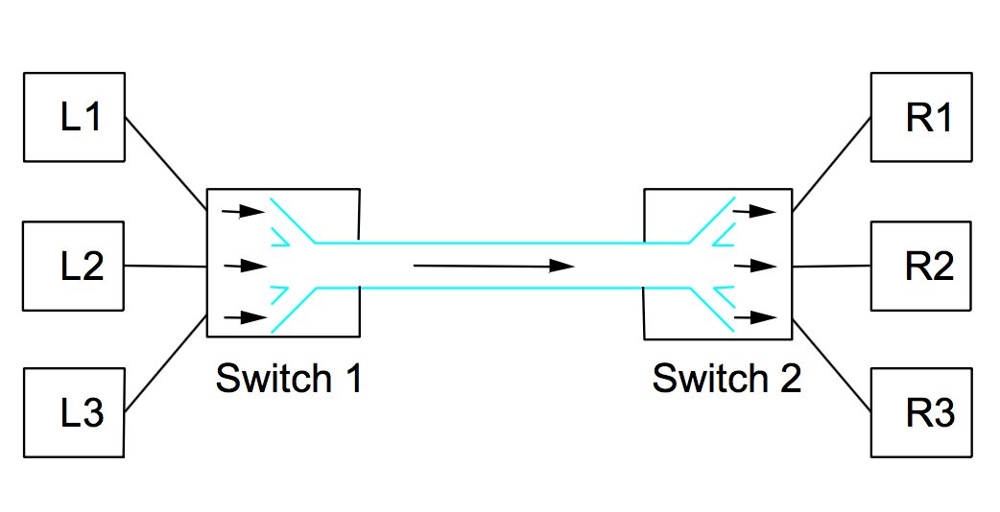
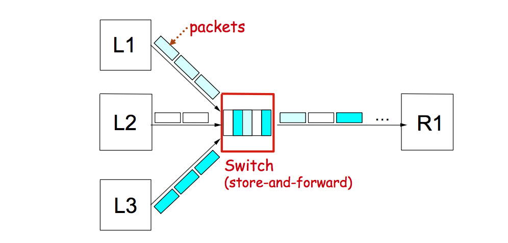
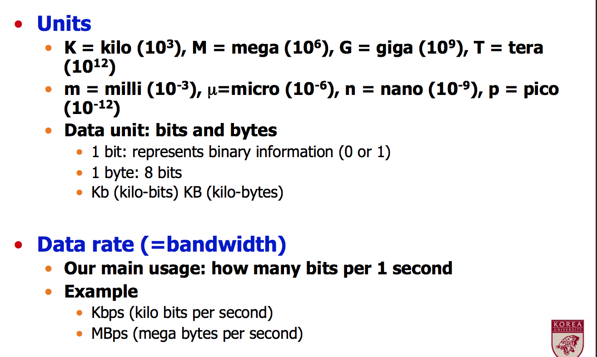
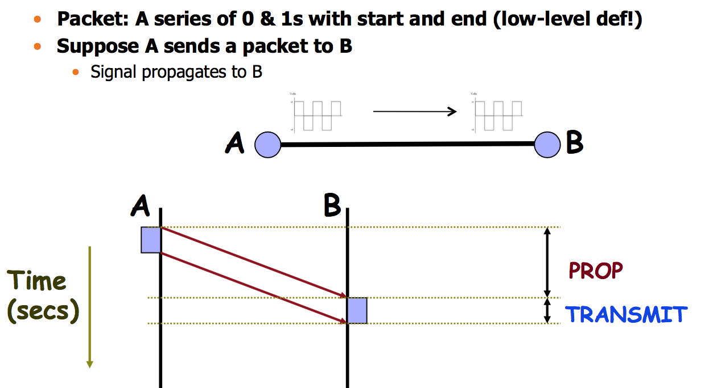

# Computer_Networks_170911
## Packet Switching 
훨씬 prevalent함
* store and forward
데이터 포맷과 관련이 있음. 

* Data is in packets
Packet : finite size block of data
boundary가 있고, finite함. (circuit은 계속 continuous함) 

* ON-DEMAND resource allocated
받는 대역폭이 요구사항에 따라 달라짐 

* 그래서 efficient resource usage가 가능함 
(circuit이 고정된 걸 할당해서 낭비가 있었던거에 비하면) 

Ex) Data Networks, internet 

계속해서 DataNetwork을 길에 비유하면 
큰 트럭은 long packet, 작은 차들은 short packet에 해당함 

> 효율적인 사용이 가능하지만, congestion이 있을 수 있음.  
어떨때?
너무 많은 사람들이 resource요구하면 !
> Congestion Control이 필요함.   


## Multiplexing
여러 data stream이 합쳐지고 자원을 공유하는것
Switch가 있음, 다른 switch로 정보를 보내줌.
노드가 switch에 붙어있음 


L1이 R1으로 데이터를 보내려고 한다면 
L1 -> Switch1 -> Switch2 -> R1 

줄세우기 

멀티플랙싱 종류

* Time division multiplexing (TDM)
• Frequency division multiplexing (FDM) 
• Statistical multiplexing


###  Time Division Multiplexing (TDM) and Frequency Division Multiplexing (FDM)

#### TDM
시간을 공평하게 나누는 거. 쓸 수 있는 time을 slot으로 나누는 것
높은 frequency를 보장할 수 있음

#### FDM 
10Mhz -> 1 Mhz 만큼 주고싶다면 10명이 쓸 수 있는거 
Spectral resource(주파수) 를 공유함. 
Frequency region을 나눔
만약 어떤 유저에게 보내고 싶다면 특정 frequency 에서만 보낼 수 있음. 
동시에 보내도 간섭없이 따로 받을 수 있음

안쓰면 그냥 낭비되어버리는 resource임. 

OFDM으로 씀 
Bandwidth에 달려있고, 너무 가까우면 간섭 일어날 수 있음 

###  Statistical multiplexing
: on Demand 로 자원 공유 / 동적으로 자원 공유. packet switching network에 적합.

Switch에 노드가 3개가 있을 때, packet을 많이 보내는 애가 있고 아닌 애가 있다면
switch가 FIFO 매커니즘으로 처리해줌. 이걸 store-and-forward 라고 함
(바로바로 들어가는 대로 나가는 게 아니라 Wait 하고 나가는 거라서.)
그래도 SM은 request에 비례함. 줄서있다고해도 많이 넣은 애들이 줄에 많을 거니까.
이 switch는 queue의 한종류여야겠지! 



**문제점**
1. Overflow(패킷이 가다가 dropped될수있음)
2. Fair allocation of resource이 안됨. (TDM이나 FDM과는 다르게)
많이 요청할수록 resource를 많이 주니까


### Performance units

Bandwidth 는 frequency일수도 있는데
`Data Rate`를 말함
`how many bits per 1 second` 



### Performance metrics: Delay and Bandwidth
성능을 측정하는 잣대 

### Delay(latency)
 message가 목표점에 닿기위해서 걸리는 시간 
```
Latency=Propagation+Transmit+Queue 
Propagation=Distance/c 
Transmit=Size/Bandwidth
```
Propagation delay : 목표점에 닿기 위한 물리적인 한계
Em wave로 보낸다고 하자. 빛의 속도로 가지만, 여전히 한계가 있으니까. 먼 거리를 가면 시간이 걸릴 거임.
Trasmit delay: 실제로 그 site나 bandwidth에 전달되는 시간 
Queuing delay: 만약에 store-and-forward가 있다면, queue에서 기다리는 시간.
c는 물론 빛의 속도

* Round-trip time (RTT) between A and B 
왕복 시간 :  (delay of A->B) + (delay of B->A)
A -> B가는 delay와 B -> A 하는 delay 더한 값 


### Bandwidth 
Data rate (단위 시간동안 전달된 bit의 갯수) 


### Transmit/Propagation - example



중간에 switch가 있다고 하면 queuing delay가 생길 수 있음.
하지만 예측하기가 힘든거임.
다른 node의 activity에 달렸기 때문에 


