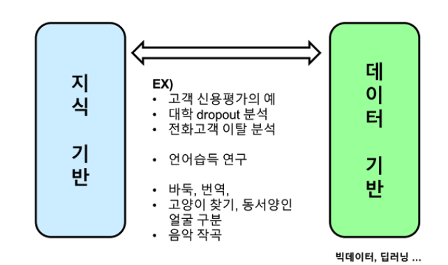

# 기계학습_170907
자료가 정리안된게 나오면 부족해서 그냥
전에 쓰던 책을 써야할 것같다. pdf가 있음  (링크는 2판) 

[2017기계학습 수업 로그](https://docs.google.com/document/d/14eVBtvW7ts-DfVxldL7_cuyODxLJTx0bhpFd6Ib7azA/mobilebasic)

막 섞여있음
#### ML
경험 데이터들이 많이 있는데 그 특징을 나타내는 공통점이 있음
그 공통점을 찾아서=>  지능적인 패턴을 찾는거 
> data로부터 intelligent한 pattern을 나타내는 알고리즘  
#### DL
데이터의 feature까지도 training해서 알아내는거
#### Data mining
전화회사 등등에서 데이터가 많이 쌓이는데 이중에서 유용한 정보를 찾고 싶다.
이런 데이터들은 대부분  profile데이터였음
그 중에서 알려지지 않은 유용한 패턴을 찾아서 내 마케팅/전략에 쓰는거 
즉 정리해서 
> 데이터를 수집하고, 데이터를 어떻게 관리를 할까(data warehouse), 그 데이터에서 유용한 패턴을 찾아내고, 그걸 어떻게 마케팅에 활용을 할까.  

어떻게 유용한 패턴을 찾아낼까?
* 통계적인 방법
* 기계학습 (그래서 섞여 있음)

DB하는 사람도 data mining한다고 얘기하기도 함

#### Big Data
1. 정형 Data
table형태를 띄고 있음. 고객 테이블이면 나이 / 사는 곳 ..
2. 비정형 Data
이런 형식 없음. Chat / 문자 /  이미지 / 소리
원래는 큰 관심이 없었던 분야인데 이 데이터들이 엄청나게 쏟아져나옴

이 데이터들을 관리할 필요가 생겼고 빅데이터다! 라고 말함
그래서 일반적인 빅데이터는 비정형 데이터를 말함

> 아 deep learning이나 ML을 적용하면 insight를 얻어낼 수 있지 않을까?  

- - - -

### 사람의 지능에서 지능 system을 어떻게 만드는가 

1) 전문가의 머릿속에 있는 것을 질문 / 인터뷰로 끄집어 내서 알고리즘 내서 시스템 만듦
경험으로만 얻은 인간의 지식은 미천함ㅋㅋㅋㅋ
이 시스템의 한계는 
* 자신의 경험한 거에 대해서만 앎
* 경험한 데이터의 양이 굉장히 작음
* 자기가 알고 있는 근거를 확실하게 모름 (그래서 전달에 문제가 있음)

2) 데이터를 모아서 기계학습 알고리즘 
훨씬 우수(데이터만 보장되어있다면)
model이 나옴
model을 가지고 다니면서 새로운 환경에서 모델을 적용해봤더니 92% 

**기계학습 알고리즘 구성**
1. 학습(분류 / 군집 / 연관 / 예측)
2. 인식(이미지/ 언어)

- - - -

우리는 자동차를 만들고 튜닝하는 사람에 해당 ㅋㅋㅋㅋ

- - - -

### 모델의 종류 

이 데이터에 다 적용이 되는 함수를 만들어 낼수있다 (모델)
1. New data가 왔을 때 예측하는데 사용할 수 있고 
2. 하나는 이 모델을 가지고 석유시추라는 도메인이 뭐가 중요한 요소인지 / 뭐가 되고 안되고 를 이해하는데 사용할 수 있음

-
#### Classification
**정형데이터**에서.
* Decision tree
자동으로 나누는 트리를 만듦
dataset과 동치 
* neural network
자동으로 dataset에 대해서 100%의 정확도 

#### Clustering
구분을 지어보기 

#### Association
항목들 간에 연관성을 찾는 알고리즘

#### Prediction
수치값을 예측하는 거 
Ex) CPU 요소들이 적혀있고 performance가 있음. 
이 데이터를 가지고 수학 공식(regression 공식) 으로 performance를 계산하는 식을 냄

새로운 CPU가 들어오면 feature가 들어오면 자동으로 나오게 하는 거 

### Data기반의 사고 
Ex) 우울증 환자 진단 어려움
찾아오지 않는 사람은 모름 
스마트폰 조도센서로 체크 => 우울증 진단할 수 있음  75퍼로!
사진으로도 할 수 있을 거가틈 사진이 주는 정보가 있음 color / 언제 찍었는지 / 앞뒤 사진과의 간격.. 

문제 해결할 때 data를 가지고 해결하려고하는 것 

Ex) 대학 dropout 분석
dropout율이 높아서 고민 -> 왜 못하는지 하는 연구 -> 그 전에는 확률통계적으로 만들고 전문가들이 알고리즘 만듦 -> 교수님이 NN으로 데이터기반으로 만듦 -> 정확도75% 

문제는 데이터가 굉장히 많고 품질이 좋아야만 함

