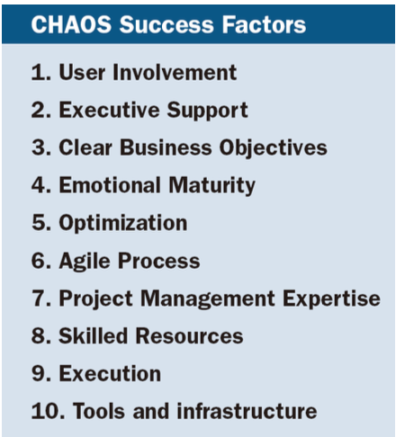

# 소프트웨어 공학_170911
실패사례가 많고 / 다 배우는 게 현실적으로 불가능함. 

어처구니 없는 이유로 사고가 날 수있고 사람이 죽을 수 있음

엔진 안꺼져서 급발진 상황 
-> Auto-off라는 기능이 왜 필요할지 등의 때는 
명확할 때도 있지만 안명확한 경우도 있음.

`Launch failure`
36초 만에 올라가다가 터짐.
3억달러 피해
64 -> 16 비트 인트변환 핸들링을 잘못해서 궁극적으로는 폭발로 이어짐.
—
어떻게 보면 인재로 볼 수도 있음
다른 환경에 대해서 테스팅이 안되어 있었음
Risk assessment해서 안해도 된다고 생각했는데 그렇게 된 것.
이 사람이 바보라서 그런게 아니라 그만큼 어렵다는 얘기!
소프트웨어 작동 환경에 대해서 가정도 세워야하고, 소프트웨어 품질 보증이 얼마나 어렵고 중요한 건지. 

`Patriot MDS`

`Lufthansa Flight` 
2904 편이 프랑크푸르트 -> 바르샤바 
> incorrect decisions and actions of the flight crew  

Test pilot 얘기는 비행기가 늦게 반응했다는 얘기임
Software의 output이 맞냐 틀리냐에 따라서만 결정할 수는 없음. 
일부 realtime sw는 정확한 값 + 타이밍이 중요함. 
Cruise control 같은 거 

- - - -
`sensor failure`
sensor가 하나면 잘못된 input -> 잘못된 처리
Sensor  여러개면 redundant 하게 처리해서 잘못된 sensor detect
But 개발할게 늘어나니까 그 과정에서 오류가 날수도 있고.

`aircraft systems`
한쪽 바퀴는 땅 / 한 쪽은 안닿았다고 가정할 때 
그런 경우 breaking system이 동작해야하는 거냐?
-> 이런 걸 다 고려해줘야함

바퀴 하나에 6.3t의 하중이 걸리면 시스템이 작동하도록함. 
나중에는 2t으로 줄임. 
맨 처음에 breaking logic을 생각할 때 많은 상황을 생각하고 분석해서 6.3t 컨디션을 만들었지만 결국은 사고로 이어지고 ..

- - - -
### best known software failures

* Therac-25
– X-ray treatment system for cancer patients
– Several fatal accidents occurred in the early 1990s – IEEE Computer, July 1993
치사량 이상의 x-ray를 주입한 것. 
이 therac 시리즈 옛버전에서는 문제가 안되던 거다가 생김.
치사량 이상을 안하도록 보장해주는 하드웨어를 이때 제거했기 때문
Nancy G.leveson 의 An Investigation of the therac-25 Accidents  볼 만함.
여기에 나온 것들의 대부분이 software 관련 대형사고들- software hall of shame
SI 프로젝트인게 많음..(소프트웨어가 크고 방대함)
• BankofNewYork
– Software error, $32B overnight loan, $5M interest daily
* Allstate
– $8M project, started in 1982, was still in progress in 1993, and company 
spent nearly $100M
미국 보험회사. 이 프로젝트는 8M 정도 될거야! 근데 100M쓰고 10년 쓰고 포기야
• USAirForceB1bomber
– Air defense software. USAF spent nearly $1B and failed to accomplish the goal


### CHAOS summary 2009
성공사례가 40%가 안된다. 
Sw 프로젝트가 성공하려면 어떤 조건이 만족되어야하냐?

1. User involvement
각각 user의 요구사항이 잘 반영됐는지?
2. 개발담당 임원이 필요한 지원을 해주는 거! 
3. Business objective 명확!
…
실제 프로젝트를 하면서 실패가능성을 줄일 때 사용함. 
PM이라구하면 그럼 8. Skilled 개발자는 어디서 고용하고 데려오고 유지할것인가?

### Top 10 Most Infamous Software Bugs of All Time

#### Mars Crashes
metric유닛이 달라서. 
10km가 아니라 10mile로 알아들었다 
뭐이런 식으로 
..
#### Therac-25 Medical Accelerator
6번 사고가 남. 
두번째까지는 그렇다쳐도 세번째부터는 인재에 가까움

500red(쬐는양) -> 50% 치사량 

#### Root causes 
* Project objectives not fully specified(51%)
• Bad planning and estimating (48%)
• Technology new to organization(45%)
• Inadequate/no project management methodology(42%)
• Insufficient senior staff on the team(42%)
• Poor performance by suppliers software/software(42%)

> 아주 trivial한 프로젝트가 아니면 planning을 해야겠지?   
> sw planning document를 만들어야함.   
> 뭐를 써야할까?   
> 기말 / 중간 / 수요일에 낼 수도있음   

