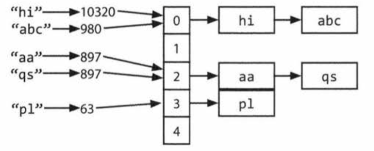

# HashTables 해시테이블

## 해시테이블이란

해시테이블은 효율적인 탐색을 위해서 key와 value를 매핑하는 자료구조의 하나이다.
간단하게 적용하는 방법을 알아보자!

다음과 같이 링크드 리스트의 배열과, 해시코드 함수가 있다고하자.
key와 value값을 삽입하기 위해서는 다음과 같이해야한다.


1. key의 해시값을 계산한다. 그 결과값은 대개 int나 long이다. key의 수는 무한하고 int값은 유한하므로, 두개의 다른 key가 같은 해시값을 가질 수 있음에 유의하자.

2. 계산한 해시 값을 배열의 인덱스에 매핑한다. 이 과정은 hash(key) 값 % 배열의 길이 등의 과정을 통해서 할 수 도 있다. 그러므로 당연히 두개의 다른 해시 코드가 같은 인덱스에 매핑될 수 있다.

3. 인덱스 하나 당, key와 value로 이루어진 링크드 리스트가 하나씩 있다. 해당 인덱스에 key와 value를 저장한다.  링크드 리스트를 사용하는 이유는 1과 2에서 말한 것 처럼, 다른 key인데 해시코드가 같거나 인덱스가 같을 수 있기 때문이다.

key로 value값을 탐색하려면 같은 프로세스를 반복한다.
즉, key로 해시코드를 계산하고, 그 해시코드에서 index를 계산해서 해당 인덱스에 대롱대롱 달려있는 링크드 리스트를 탐색하는 거다.

충돌의 횟수가 매우 높을 때, 즉 worst time complexity는 O(N)으로 본다. 이때 N은 key의 갯수이다.
그러나 충돌의 횟수가 최소라면, lookup time은 O(1)이 된다.
**TODO 충돌이 어느 경우에 일어나는지, key-value가 정확히 어떻게 저장되는 지 찾아서 추가**

이 해시테이블은 균형잡힌 바이너리서치트리로도 만들 수 있다. 이때는 O(log N)의 lookup time을 갖는다. 이렇게 구성하는 방법의 장점은 (큰 배열을 할당할 필요가 없어서 )space(메모리)를 덜 쓴다는 점이다. 또한 순서대로 key를 반복하며 탐색할 수 있는데, 가끔은 이런 방식이 유용하다(순서대로 탐색할 때가 있다는 뜻)


#  ArrayList & Resizable Arrays 어레이리스트와 크기조정가능한 배열


## ArrayList의 필요성
어떤 프로그래밍 언어에서는 배열(이런 경우 리스트라고 불림)들이 자동적으로 크기 조정이 된다. 배열(혹은 리스트)는 아이템을 추가함에 따라 커지곤한다. 하지만 자바에서는 배열이 고정된 길이를 가진다. 배열을 선언 할 때 크기가 정해지곤 한다.

배열 같은 자료구조가 필요한데 동적으로 리사이징이 필요하다면, ArrayList를 쓴다.
ArrayList는 크기를 스스로 조절하지만 여전히 (접근할 때) O(1)의 시간 복잡도를 주는 배열이다.
(의역) 이 arraylist는, 배열이 꽉차면 배열의 크기를 두배 늘리고 이 과정 자체가 O(n)의 복잡도를 갖지만!
그런 일이 거의 없기때문에 삽입 시간이 O(1)에 근사한다.


### 왜 Amortized insertion runtime이 O(1)인가?

거꾸로 생각해보면 된다. 크기가 N인 배열을 생각해보자.
이 배열을 만들기 위해서,바로 이전에는 n/2 개의 요소를 복사해왔어야했다.
그전에는 크기가 n/2였으므로, 그것의 반인 n/4 개를 , ... 2개, 1개를 ..
그러므로 N개의 요소를 삽입하기 위해서 복사했어야하는 총 복사본의 갯수는 약
N/2+N/4+N/8 + ... + 2 + 1 개 이다.

> 간단한 무한등비급수 문제다. S = a /(1-r)   (S는 급수, a는 초항, r은 등비) 임을 기억한다면!
 N/2 / (1/2) = N 즉 N에 수렴한다. 그러나 수렴이라는 말은 N과 같다 라기 보단 N에 한없이 가까워진다는 뜻이므로 이 갯수는 N보단 작다.

그러므로 N개를 삽입하는건 O(N) 의 복잡도를 가진다. 각각의 삽입은 평균적으로 O(1) 이다. 어떤 건 최악의 경우에 O(N)이긴 해도.


# StringBuilder

아래와 같은 String의 리스트를 연결해본다고 생각하자. 이 코드의 실행시간은 어떻게 될까?
편의를 위해 이 문자열들이 같은 길이 x를 가진다고 하고 n개의 문자열이 있다고 하자.

```
 String joinWords(String[] words){
   String sentence = "";
    for(String w: words){
       sentence = sentence + w;
    }

    return sentence;
 }
```

한번 연결할 때 마다, 새로운 문자열의 복사본이 생기고, 두 문자열이 복사된다. 문자 하나 하나 마다 말이다.
처음 반복할 땐 x 개의 문자를 복사해야하고, 두번째는 2x개, 세번째는 3x개다. 그러므로
O(x+2x+...+nx) 고 이는 O(n(n+1)/2 * x )니까! O(xn^2)이다.

StringBuilder는 이 문제를 해결해준다. 이 친구는 모든 문자열에 대해서 크기조정되는 배열을 만들어주고 필요할 때만 다시 문자열로 복사해준다.

```
 String joinWords(String[] words){
   StringBuilder sentence = new StringBuilder();
   for(String w: words){
     sentence.append(w);
   }
   return sentence.toString();
 }
```


# 연습문제들

## 1.1 Is Unique
문자열이 모두 유니크한 문자를 갖고 있는지 판단하는 알고리즘을 적어보자. 추가적인 자료구조를 쓸 수 없을 때도 적어보자.

* ASCII 인지, extended ASCII인지, Unicode인지 면접관에게 물어보는 게 도움이 된다.
답에 따라서 저장하는 배열의 크기를 조정하자. ASCII라고 가정하겠다.

```
 public boolean isUniq(String s){
    boolean char_set = new boolean[128];

    for(int i=0;i<s.length();i++){
      int val = s.charAt(i); // 문자열의 i번째 문자의 ASCII 값을 저장한다.

      if(char_set[val]){ //만약 해당 ASCII값에 해당하는 값이 true이면 처음이 아님
        return false;
      }else{
        char_set[val] = true; //만약 해당 ASCII값에 해당하는 값이 false이면 처음임
      }

    }
    return true;
 }
```

O(n)의 시간 복잡도와 O(1)의 공간복잡도를 가짐.

## 1.2 Check Permutation
두 문자열이 주어졌을 때, 하나가 다른 하나의 permutation인지 판단하라.
즉 순서만 바꿔서 같은 문자가 되는지 판단하라는 문제

``
