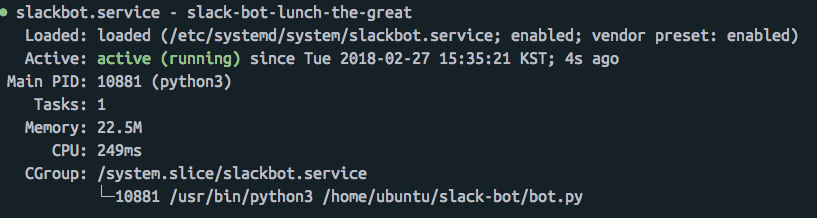

# 우분투에서 파이썬 스크립트로 데몬(서비스) 만들어 백그라운드에 등록하기


데몬(혹은 서비스)는 백그라운드에서 계속해서 동작하는 프로세스를 의미한다.
웹서버도 일종의 데몬이며, uwsgi 를 설정해줄 때 uwsgi 서비스 파일을 만드는 것도 그러한 맥락에서다.

## 문제상황

lunch-the-great 이라는 슬랙 점심 봇을 만들었다.

이 봇은 기본적으로 bot.py라는 파일이 실행중일 때만 동작한다.

`python3 bot.py` 를 사용하는 건 문제가 있다. 이 파일을 실행시킨 세션을 종료하면 이 프로세스도 같이 종료되기 때문이다.

그래서 'nohup python3 bot.py &' 커맨드를 사용해서 세션 종료 신호에 영향을 받지않고 프로세스를 돌리도록 했다.

그랬더니 오랫동안 사용하지 않은 경우에는 (원인불명) 프로세스가 사라지는 문제가 있었다.

나는 이 슬랙 점심 봇을 웹서버처럼 24시간 돌리고 싶다. 설사 요청이 별로 없더라도!

## 답은 [서비스]다

항상 프로세스가 백그라운드로 돌아가고, 종료시에도 다시 돌아가도록 하려면 서비스로 만드는 방법이 있었다.

일단 내가 실행시키고자한 스크립트는 다음과 같았다.

### 파이썬 스크립트

```python
#!/usr/bin/python3
# -*- coding: utf-8 -*-
from slackclient import SlackClient
import time
import os
import json
from google_sheet import *
import re

def script(slack_client,channel,text):

     google_sheet_url = "https://docs.google.com/spreadsheets/d/1ExhD_kvJN-pznmyvP1MfZlVFSbu_sjXDbnBGigNw6DU/edit#gid=0"
     p = re.compile('점심|저녁|밥|배고파|맛집')
     if any(p.findall(text)):
         menu, info, url = load()
         slack_client.api_call(
                            'chat.postMessage',
                            channel=channel,
                            attachments=[{"fields": [
                {
                    "title": menu,
                    "value": info,
                }
            ], "image_url": url, "title": "코드스쿼드맛집지도", "title_link": google_sheet_url}],
                            as_user='true:'
                        )
     if '아침' in text.lower() or '브런치' in text.lower():
         slack_client.api_call(
                           'chat.postMessage',
                           channel=channel,
                           text='그런건 우리에게 있을 수가 없어..',
                           as_user='true:'
                        )
def main():
    with open("envs.json") as f:
        dict = json.load(f)
        token = dict["API_TOKEN"]
        slack_client = SlackClient(token)

    if slack_client.rtm_connect():
        while True:
            events = slack_client.rtm_read()
            for event in events:
                if (
                        'channel' in event and
                        'text' in event and
                        event.get('type') == 'message'
                ):
                    channel = event['channel']
                    text = event['text']
                    script(slack_client,channel,text)
            time.sleep(1)


if __name__ == "__main__":
    main()
```

슬랙에서 누군가 특정 단어를 말하면, 그에 따라 구글 문서에 있는 정보를 긁어서 리턴해주는 스크립트이다.

상단에는 꼭 이 python script가 실행될 python 환경에 대한 명시가 필요하다.

나는 python3 을 사용했고 그 위치가 `/usr/bin/python3` 이기 때문에 이렇게 명시해주었다.

### 서비스 설정

```bash
cd
sudo vi /etc/systemd/system/<서비스명>.service
```

나는 서비스명을 `slack-bot.service`로 했다.

vim이 열리면 다음과 같은 내용을 적어준다.

```shell
[Unit]
Description=slack-bot-lunch-the-great
After=multi-user.target

[Service]
Type=idle
WorkingDirectory=/home/ubuntu/slack-bot/
User=ubuntu
Group=ubuntu
ExecStart=/usr/bin/python3 /home/ubuntu/slack-bot/bot.py
Restart=on-failure

[Install]
WantedBy=multi-user.target
```

Description에는 그냥 설명을 적어준다.

WorkingDirectory에는 파이썬 스크립트가 위치한 절대경로를 적어준다.

User와 Group은 스크립트의 소유권한에 맞춰서 적어준다. (경로에서 `ls -al` 커맨드로 확인할 수 있다.)

ExecStart는 `<사용할python절대경로> <python스크립트절대경로>` 로 적어준다.

Restart는 임의로 종료한게 아니라 failure가 나서 종료되었을 때 자동으로 재시작을 하도록 옵션을 걸어 주었다.

### 재시작

```bash
sudo systemctl daemon-reload
sudo systemctl enable <서비스이름>
sudo systemctl start <서비스이름>
```
를 통해 서비스를 등록하고 실행시킨다.

```bash
sudo systemctl status <서비스이름>
```

로 서비스가 잘 돌아가는지 확인한다. 다음과 같이 뜨면 성공이다.



## 문제 해결

만약 어떤 module이 없다고 나오면 pip3 을 사용하여 설치하자.

pip3 이 설치되어있는데도 안된다고 나오면, 스크립트에서 해당 import 부분을 지웠다가 다시 적고 stop-start를 거쳐보자.

스크립트 파일이 잘못되면 당연히 에러가 뜬다.
