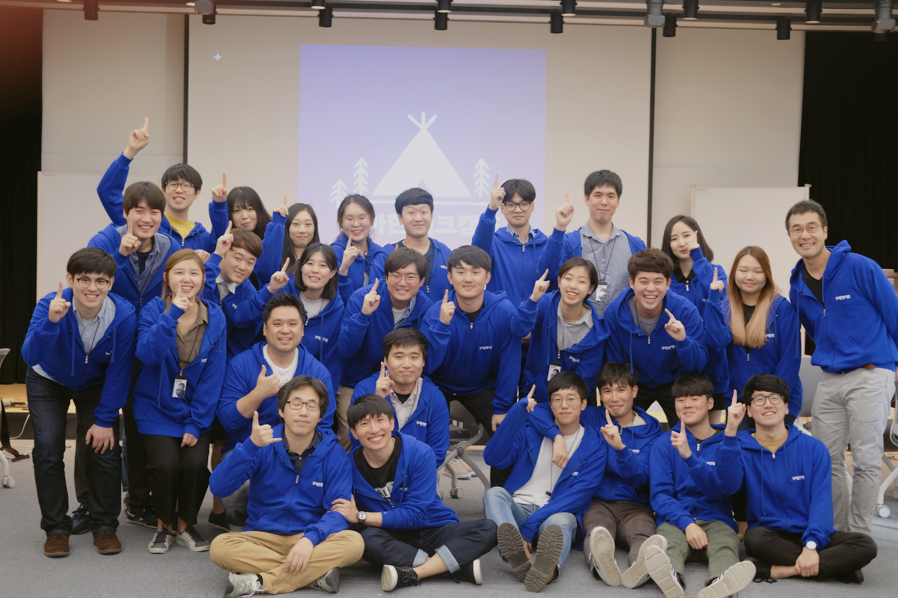

- - - -
layout: post
title:  “넌 강해졌다, 돌격해!”
description: “우아한 테크캠프를 마치며”
author: junekim
date:   2017-09-02 09:00:00 +0900
categories: experience
published: true
- - - -
## 들어가며
안녕하세요. 우아한 테크캠프 iOS 개발 인턴이었던 김준영입니다. 지난 8월 31일에 우아한 테크캠프를 마쳤습니다.  좋은 책을 다 읽은 것처럼 아쉬움과 기분좋은 여운이 남아있네요.

테크캠프에서 배운 점이 학부에서의 몇년보다 많아, 꼽기 어렵습니다.
그래도 그 중 몇 꼭지를 꼽아  우아한 테크캠프에서 무얼 경험했고 배웠는지를 공유하고자 합니다.

## 우아한 테크캠프?
배달의 민족을 필두로 세상을 바꾸고 있는 우아한 형제들과
코딩교육으로 가치를 만드는 코드스쿼드의 역대급 콜라보 교육과정입니다.
개발 인턴과 흡사하지만, 일반 인턴과정과는 달리 코드스쿼드의 마스터님들이 직접 가르치실 정도로
교육에 방점이 찍힌 프로그램이었습니다.
또한 개발뿐 아니라 **함께, 스스로** 라는 가치에 중점을 두고 협업을 위한 방법을 익힙니다.
지원자들 입장에서는 교육 + 인턴 + 실습 + 프로젝트를 모두 잡을 수 있는 기회였죠.

## 무슨 경험을 하고 무얼 배웠나

### 클린 코더가 되기 위한 지식들
iOS 는 코드스쿼드 김정 마스터님께, 웹 프론트엔드는 코드스쿼드 윤지수 마스터님께 3주간 가르침을 받았습니다.  그 과정에는 swift 와 javascript에 대한 지식도 있었고, 코딩을 어떻게 하는 지에 대한 내용도 있었습니다.
그 중, 정말 도움이 되었던 건 **어떻게 협업할 수 있는 코드** 를 짤 수 있을 지에 대한 조언이었습니다.

저와 같은 주니어 개발자(지망생)들은 대부분 혼자 개발을 시작하게 됩니다.
자연스레 기능만 돌아가면 되지! 라고 생각하고 개발을 하는 게 보통입니다. 다른 사람이 제 코드를 읽을 거라고 가정하지 않지요. 하지만 테크캠프는 시작부터 다음과 같은 얘기를 하면서 시작했습니다.

> 코딩은 글쓰기와 비슷합니다. 늘 다른 사람이 내 코드를 읽을 거라 생각하고 작성하세요.  

이런 가정하에, 다음과 같은 이야기들을 들을 수 있었습니다.

* 프로젝트 폴더 / 구조 를 의미있는 단위로 나눠보세요.
* 파일명 / 변수명을 일관된 규칙으로 작성해보세요.
* 공통된 데이터 구조나 모델이 남아있지 않은 지 점검해보세요.
* 객체의 책임과 역할을 명확하게 나눠보세요. 하나의 객체가 이것저것 할 필요는 없습니다.
* 함수는 하나의 역할 / 기능만 담당하는게 명확합니다.
* 코드 리뷰는 자신의 코드를 방어하는 시간이 아닙니다.

이런 이야기를 프로젝트 내내 바로바로 들을 수 있었고, 이는 코드의 방향성을 잡는 데 무척 도움이 되었습니다.
자연스레 기능 구현만이 아니라  `같이 일하고 싶은 코드` 를 짜는데 방점이 찍히기도 했구요.

### 다른 분야의 개발자와 같이 일하는 경험
테크캠프의 프로젝트는 한 서비스를 웹과 iOS 두 방향으로 만드는 것이 목표였습니다. 이에 따라 팀도 웹 FE 두명, iOS 두명으로 구성되었습니다. 여태까지 경험한 프로젝트는 같은 분야의 개발자와만 일하는 데에서 그치는데 반해, 테크캠프에서는 색다른 경험을 할 수 있었습니다.

저희 팀은 Google Firebase 로 백엔드를 구축하고 관리했는데요, 같은 데이터베이스를 쓰기 위해서 끊임없이 소통해야했습니다. 웹이 사용자 데이터를 날리면 모바일이 갑자기 뻗어버리는 현상이 있지 않나, 모바일에서 올린 리뷰가 바로 웹에서 뜨게 하도록 해야하고.. 당연히, 한 플랫폼만 개발하는 데에 비해서 고려해야할 변수가 많았습니다. 데이터 구조에 대해서 합의해야 했고, 데이터를 업데이트하는 방식도 이야기를 꾸준히 나눠야했습니다. 데이터의 메이저 변경점이 있으면 즉각적으로 모두가 알아야했구요. 이를 위해 `어떻게 변경점을 알릴 것인지` 합의 했고, 협업도구를 통해 모두가 변경사항을 알 수 있도록 했습니다.

같은 서비스라는 느낌을 주는데도 애로 사항이 있었습니다. 같은 스펙을 구현해야 했구요, UI에서도 사용자에게 동일 서비스를 사용하는 느낌을 주기 위해서 끊임없이 얘기해야했습니다. 때문에 서로의 서비스를 사용해보면서 중간 지점을 찾고 타협하는 과정을 거쳤습니다.

이렇게 협업을 해보니, 한 서비스를 만들어내는 개발자분들 (특히 우아한 형제들)이 너무 대단하게 느껴졌습니다. 일의 절반은 커뮤니케이션 비용이라는 말도 절감했구요. 다른 사람들과 같이 일하기 위해서는 꼼꼼한 설계 후 개발도 꼭 필요하다는 점을 느꼈습니다.

### 오픈 소스 사용과 이삭줍기 경험
저희 프로젝트는  유난히 뷰가 많은 편이었습니다. 직접 뷰를 짜본 경험이 적어 헤매던 중,  마스터님께서 [Cocoa Controls](https://www.cocoacontrols.com/)  를  소개해주셨습니다. Cocoa Controls에는 다양한 iOS UI 컴포넌트 오픈 소스들이 올라와있는 사이트입니다. 마침  기본 검색 뷰는  앱의 테마 방향과 어울리지 않아, 이 [검색뷰](https://github.com/younatics/YNSearch)를 참고해서 사용하게 되었습니다.

그런데 막상 소스를 받고 보니 저희 앱에 맞게 고쳐야할 점들이 있었습니다. 일단 영어로 된 항목을 한글로 고쳐야했습니다. 그리고 검색 결과를 누르면 원하는 화면으로 가도록 해야했고, 텍스트가 하나하나 입력 될 때마다 검색하는 방식이 아니어야했습니다. 고치고 나서 원하는 대로 동작 하는지 확인해야 하니, 오픈 소스가 어떻게 작동하는 지 알아야했습니다. 이 과정에서 데모를 돌리고 파일을 하나하나 뜯어 보았습니다.

원하는 대로 고치고 나니, 또 하나의 고민이 생겼습니다. 이렇게 `고친 소스를 팀원과 공유해야하는 문제`였습니다. swift의 의존성 관리 도구는 Cocoa pod를 사용했는데, podfile에 원하는 pod을 등록해놓고 `pod install` 커맨드로 설치하는 방식입니다. 이때 설치되는 건 물론 제가 고친 소스가 아니라..  원본 소스가 되겠죠. 마스터님께  여쭤보니, 이런 경우  pod으로 관리하는 게 아니라 프로젝트 파일 하위에 포함해서 사용해야한다고 하셨습니다.

소스를 고치면서, 오탈자를 발견했었습니다. 침착하게 배운대로 저장소를 fork 한 뒤, 변경점을 커밋해서 pull request를 날렸습니다. 그랬더니 짜잔!

저의 첫 오픈소스 기여 기록이 생겼습니다!

오픈 소스를 써보기 위해서는 자잘한 지식이 기반이 되어있어야 했습니다. 의존성을 관리하는 법, 프로젝트 구조, git과 github에 대한 이해도 필요했구요. 이런 부분이 막힐 때마다 여쭤볼 마스터님들이 계셔서 빠르게 적용할 수 있었습니다.

### 다른 공부를 도전해보는 기반
위에서 잠깐 말씀드렸지만 저희 팀은 Google Firebase로 백엔드를 구축했습니다. 우아한 테크캠프에서 백엔드를 다루지 않는 만큼, 빠르게 프로젝트를 만들기 위한 선택이었습니다. 하지만 프로젝트가 진행될수록 속도에 대한 답답함이 생겼습니다.

> 다른 팀들처럼 api 서버를 만들 수는 없을까?   

테크캠프에서는 AWS에 express를 올리는 실습을 간단하게 다뤘었습니다. 그래서 인지, 배워서 해볼 만 할 거라는 자신감이 생겼습니다. 다른 팀들 중에는 rails로 백엔드를 구축한 팀이 있어, django도 되지 않을까? 하는 생각이 들었구요. 결국 django를 AWS  EC2에 올려서 돌리면 되는 거 아냐? 하는 생각에 도달했습니다. 바로 정호영 마스터님께 질문했습니다.

바로 그 주 주말, 추천해주신 튜토리얼을 기반으로 django rest framework 를 공부하기 시작했습니다.  
`djangorestframework` 와 `django-rest-swagger` 를 적용하는 내용의 튜토리얼을 따라간 결과, 하루 정도 만에 원하는 대로 구현하는 데 성공했습니다.

교육동안 swift에서 json을 받아오는 걸 배웠으니, 앱에 연동하는 건 쉬운 일이 되었습니다.

아쉽게도 결국 프로젝트에는 drf를 적용하지 못했습니다. 다만 배운 건, 지식이 하나씩 늘 수록 할 수 있는 건 몇 배로 불어난다는 점이었습니다. 이전에는 aws도, git, api 도 잘 몰랐기 때문에 조금만 더 배우면 api 서버 구현을  할 수 있다는 사실 자체를  몰랐습니다. 또한 그때 그때 잡아 주시는 마스터님 덕분에 시간 낭비하지 않고 용감하게 배워볼 수 있었죠. 그래서인지 팀원들도 파이썬으로 크롤링을 배워 바로  프로젝트에 적용하는 등 다른 공부에도 도전한 모습이 기억납니다.

### 사람들에게 배운 점
우아한 형제들에는 매주 목요일마다 CTO실 전체가 랜덤하게 점심을 함께하는 ‘개발자 런치’ 문화가 있습니다. 감사하게도 테크캠프 인턴들이 교육기간 동안 이 런치에 참여할 수 있었습니다. 또한 강연과 대담 시간에도 개발자 분들이 조언을 아끼지 않으셨죠. 그래서 저희는 우아한 형제들의 개발자 분들의 이야기를 들을 기회가 다양하게 있었습니다.

그 중 인상깊게 남았던 것 중 하나가 개발자로서의 재능에 대한 얘기였습니다.
개발자가 되고자하면서 가장 고민인게 `내가 재능은 있는거야?` 하는 이야기일 겁니다.
웹FE 개발자분들과의 대담 중 이 질문에 대한 대답을 들어, 여기에 일부를 옮깁니다.

> 사실 개발에 지치고, 개발이 배우기 어렵고 하는 건 항상 있는 일이에요. 재미가 없을 수도 있어요. 그럴 때마다  '내 적성은 이게 아닌가? ' 하는 분들을 봅니다.  
> …  
> 지금 개발이 좋다고 하면, 스스로의 모티베이션을 만들어가는 노력을 해보세요. 다른 사람이 '이래야한다' '이렇게 하자' 라고 어떤 근사한 동기부여를 해도 그건 자기 것이 아니거든요. 스스로 나아갈 줄 아는 게 재능이에요.  

테크캠프 인턴 친구들에게도 많이 배웠습니다.
이 친구들은 참 이상합니다. 분명히 6개 팀으로 나뉘어서 서로의 프로젝트를 발표해야하는 데 경쟁심이 없습니다.
다른 팀이 막히는 부분을 소스코드를 같이 보면서 고쳐보고, 모르면 찾아서라도 알려줍니다.  
좋은 소스가 있으면 공유하고, 데모가 잘 안되면 진심으로 안타까워합니다.
서로의 서비스를 적극적으로 사용하면서 개선점을 말해주고 갑니다.
이런 태도와 분위기 덕분에 누구나 모르는 걸 부끄러워하지 않고 적극적으로 배울 수 있었습니다.

## 마치며
꿈같던 테크캠프가 끝나고 이제 현실로 돌아갈 때가 되었네요.
이런 기회를 제공해주신 우아한 형제들, 코드스쿼드, techHR 팀분들께 너무 감사합니다.
만약 후에 테크캠프 지원을 망설이시는 분이 있다면, 더 강한 개발자가 되기위해서 꼭 지원하세요.
이보다 더 행복하게 성장할 기회는 많이 없으니까요.
부족한 글 읽어주셔서 감사합니다.

