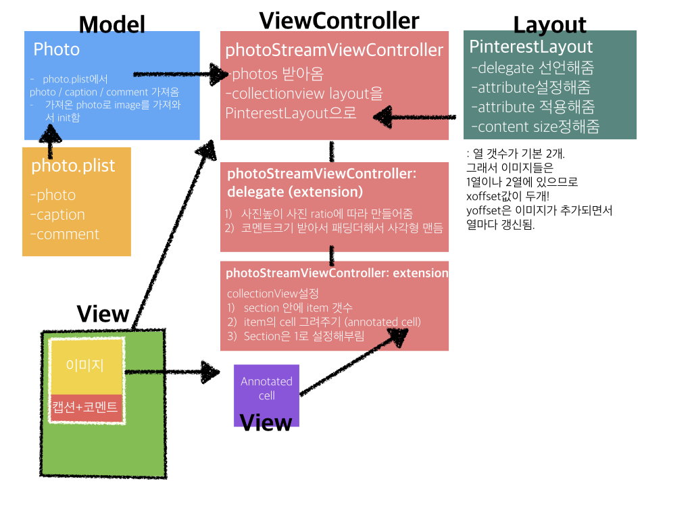

# Swift에서 CollectionView

collectionView는 tableView로 안되는 View를 구성하고자하는 요구를 충족하기 위해 나타났다!

## CollectionView의 구조
CollectionView에 관련된 클래스와 프로토콜들은 다음과 같다.

```
UICollectionView
# UITableView에 해당. Interface Builder에서 볼 때 CollectionView를 쓰려는 곳이 일부일 때 사용.
UICollectionViewController
# UITableViewContrller에 해당. IB에서 볼때 CollectionView가 전체일 때 사용.

UICollectionViewDataSource
# collectionView에 들어갈 데이터들을 구성한다.

UICollectionViewDelegate
# collectionView에 대한 정해진 액션을 구현한다.
# 예를 들어 cell을 선택했을 때 어떻게 할 것인지, 선택을 취소했을 때 어떻게 할 것인지!

UICollectionResuableView
# CollectionView에는 header / footer뿐 아닌 supplimentary View(위 / 아래 / 옆)의 공간이 있는데, 이에 관련

UICollectionViewCell
# Cell 내부의 View를 구성한다.

UICollectionViewFlowLayout ; UICollectionViewDelegateFlowLayout
# 셀 주변의 공간과 셀을 배치 할때 어떤 구조로 할거냐!

```


## 어떻게 뿌려주는가
CollectionView는
`Delegate`와 `Data Source`를 통해 cell을 얻고, `Collection view layout` 을 통해 layout의 정보를 읽어서
최종적으로 뷰를 뿌려줌!

## DataSource
테이블은 section - row의 구조인데 반해,
콜렉션은 section - item의 구조를 띈다.
이는 콜렉션에서는 한 줄(row)가 아닐 수 있기때문이다!


## FlowLayout이 아니라 Custom Layout!
FlowLayout은 기본적으로 제공하는 layout이다.
한 Section에 대해서, 주어진 폭보다 cell이 많으면 자동적으로 다음줄로 넘어가 차곡차곡 쌓이게 된다.
하지만 이런 Layout은 이제 그만하고 싶은 당신!
침착하게 Custom Layout을 짜보자!

### CustomLayout 파일에는 뭘 구현하지?
```
CustomLayout : UICollectionViewLayout 내부!

prepareLayout
# 함수로는 prepare()
# cell별 위치가 어디서 시작하는지, 넓이는 얼마나 되어야하는 지, attribute를 지정해주는 친구.
# 최초 한번만 attribute를 저장하고 cache에서 꺼내 쓰기도한다.

collectionViewContentSize
# 상수! override var collectionViewContentSize : CGSize
# cell별 contentSize를 다 불러주는 친구.

layoutAttributesForElementsInRect
# 함수! func layoutAttributesForElements(in rect: CGRect) -> [UICollectionViewLayoutAttributes]?
# 어떤 위치에 있는 애들이 보이는지 그 위치가 넘어옴. 그러면 현재 보이는 사각형에서 겹치는 cell의 attribute만 불러줘야함!

```

이 위에는 attribute도 구현해줄때도 있고, 아닐 때도 있다!

### PinterestLayout 샘플!

```
protocol PinterestLayoutDelegate {
  // 1. Method to ask the delegate for the height of the image
  func collectionView(_ collectionView:UICollectionView, heightForPhotoAtIndexPath indexPath:IndexPath , withWidth:CGFloat) -> CGFloat
  // 2. Method to ask the delegate for the height of the annotation text
  func collectionView(_ collectionView: UICollectionView, heightForAnnotationAtIndexPath indexPath: IndexPath, withWidth width: CGFloat) -> CGFloat

}

class PinterestLayoutAttributes:UICollectionViewLayoutAttributes {

  // 1. Custom attribute
  var photoHeight: CGFloat = 0.0

  // 2. Override copyWithZone to conform to NSCopying protocol
  override func copy(with zone: NSZone?) -> Any {
    let copy = super.copy(with: zone) as! PinterestLayoutAttributes
    copy.photoHeight = photoHeight
    return copy
  }

  // 3. Override isEqual
  override func isEqual(_ object: Any?) -> Bool {
    if let attributtes = object as? PinterestLayoutAttributes {
      if( attributtes.photoHeight == photoHeight  ) {
        return super.isEqual(object)
      }
    }
    return false
  }
}


class PinterestLayout: UICollectionViewLayout {
  //1. Pinterest Layout Delegate
  var delegate:PinterestLayoutDelegate!

  //2. Configurable properties
  var numberOfColumns = 2
  var cellPadding: CGFloat = 6.0

  //3. Array to keep a cache of attributes.
  fileprivate var cache = [PinterestLayoutAttributes]()

  //4. Content height and size
  fileprivate var contentHeight:CGFloat  = 0.0
  fileprivate var contentWidth: CGFloat {
    let insets = collectionView!.contentInset
    return collectionView!.bounds.width - (insets.left + insets.right)
  }

  override class var layoutAttributesClass : AnyClass {
    return PinterestLayoutAttributes.self
  }

  override func prepare() {
    // 1. Only calculate once
    if cache.isEmpty {

      // 2. Pre-Calculates the X Offset for every column and adds an array to increment the currently max Y Offset for each column
      let columnWidth = contentWidth / CGFloat(numberOfColumns)
      var xOffset = [CGFloat]()
      for column in 0 ..< numberOfColumns {
        xOffset.append(CGFloat(column) * columnWidth )
      }
      var column = 0
      var yOffset = [CGFloat](repeating: 0, count: numberOfColumns)

      // 3. Iterates through the list of items in the first section
      for item in 0 ..< collectionView!.numberOfItems(inSection: 0) {

        let indexPath = IndexPath(item: item, section: 0)

        // 4. Asks the delegate for the height of the picture and the annotation and calculates the cell frame.
        let width = columnWidth - cellPadding*2
        let photoHeight = delegate.collectionView(collectionView!, heightForPhotoAtIndexPath: indexPath , withWidth:width)
        let annotationHeight = delegate.collectionView(collectionView!, heightForAnnotationAtIndexPath: indexPath, withWidth: width)
        let height = cellPadding +  photoHeight + annotationHeight + cellPadding
        let frame = CGRect(x: xOffset[column], y: yOffset[column], width: columnWidth, height: height)
        let insetFrame = frame.insetBy(dx: cellPadding, dy: cellPadding)

        // 5. Creates an UICollectionViewLayoutItem with the frame and add it to the cache
        let attributes = PinterestLayoutAttributes(forCellWith: indexPath)
        attributes.photoHeight = photoHeight
        attributes.frame = insetFrame
        cache.append(attributes)

        // 6. Updates the collection view content height
        contentHeight = max(contentHeight, frame.maxY)
        yOffset[column] = yOffset[column] + height

        column = (column >= (numberOfColumns - 1)) ? 0 : (column+1)
      }
    }
  }

  override var collectionViewContentSize : CGSize {
    return CGSize(width: contentWidth, height: contentHeight)
  }

  // 어떤 위치에 있는 애들이 보이는지 그 위치가 넘어옴. 그러면 고 안에 있는 엘리먼트만 attribute적용해서 보여줘야함. 나머지 밖에는 재사용할거라서.

  override func layoutAttributesForElements(in rect: CGRect) -> [UICollectionViewLayoutAttributes]? {

    var layoutAttributes = [UICollectionViewLayoutAttributes]()

    // Loop through the cache and look for items in the rect
    for attributes  in cache {
      if attributes.frame.intersects(rect ) {
        layoutAttributes.append(attributes)
      }
    }
    // 교차점이 있으면 그 attribute를 .
    return layoutAttributes
  }
}

```

### Pinterest App 동작 구조

