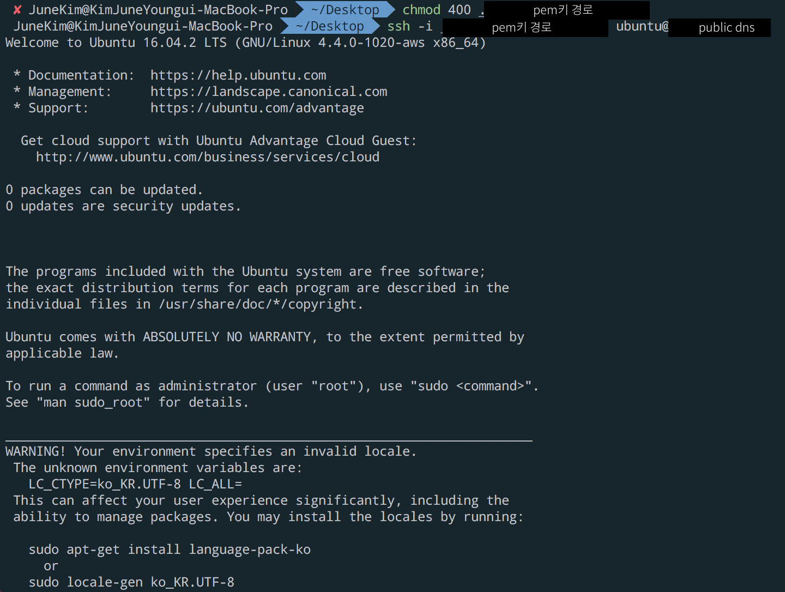
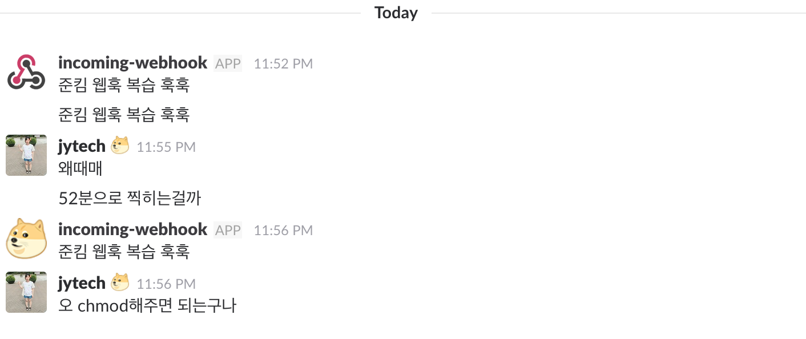

# Slack Webhook을 만들어보자!

Slack은 많은 회사에서 사용하고 있는 협업 툴로,
채널별로 주제를 나누어 얘기를 할 수 있는 장점이 돋보인다.

이 Slack 서비스에 webhook을 통해 간단한 봇을 제작할 수 있다.

사실 OS X 라면 딱히 AWS 기반으로 해야할 필요는 없지만, 이후 ec2 인스턴스에 관한 스크립트를 짤 예정이라
이 환경을 기반으로 포스팅합니다.


## AWS ubuntu 설정

AWS instance를 만드는 과정은 생략하겠다.
AWS에 ubuntu를 설치해서 instance를 start 해두었다.

이후 다음과 같은 커맨드를 통해
ssh로 AWS에 접속하고, 우분투를 간단하게 설정해준다.



```
chmod 400 pem키경로
# pem키의 권한을 변경해준다.
```


### 별첨 : chmod 숫자의 뜻

chmod는 change mode의 줄임말이다.
chmod 뒤에 오는 숫자에 따라서 해당 파일의 권한이 달라진다.
이 숫자는 세 자리로 이루어지는데,개인권한/그룹권한/전체권한을 의미한다.

권한 중
4는 readonly를,
0은 모든 권한 없음을 뜻한다.
기본적으로 read(4) / write(2) / execute(1) 의 권한이 있으므로
숫자는 권한을 조합해서 나온다고 생각하면 된다.
예를 들어 5 = 4 + 1 이므로 read와 execute권한이 있다는 뜻이다.

결국, chmod 400은 `내게만 읽기권한을 주겠다` 라고 말하는 것과 같다.


이어서 설정을 보자.

```
ssh -i pem키경로 ubuntu@publicip
# ubuntu라는 유저네임은 ubuntu를 설치했으면 공통이다. 깔린 os에 따라서 username이 바뀌곤한다.

sudo apt-get update
sudo apt-get upgrade
# 우분투가 설치됐으면 패키지를 받고 업그레이드 과정을 거쳐준다.

$ sudo apt-get install language-pack-ko
# 한글팩 설치하기
```


### 우분투에 한글팩 설정하기 (오류나 알림 등이 한글로 나옴)
#### $HOME/.bashrc
`$ vi ~/.bashrc` 를 통해 .bashrc파일을 열고 다음을 추가한다.

```
LANG="ko_KR.UTF-8"
LANUGAGE="ko_KR:ko:en_US:en"
```

`esc + :wq  나 shift + z*2 ` 로 저장한다음 bash에서
```
$ source ~/.bashrc
# bash를 켜면 자동으로 실행되는 파일 중 하나가 bashrc임. 따라서 실행시에 자동으로 셋팅해주고 싶은 것이 있으면, 이 파일에 추가를 하면 됨.
$ locale
$ env
```


## Slack의 webhook 주소 알아내기

webhook을 넣을 채널을 연다.
채널 최상단에 Add an app or custom integration을 클릭하고,
Webhook을 검색한다.

이미 채널에 설정되어있다면 webhook_url을 찾아 개인적으로 보관하고,
아니면 다음 [url](http://seotory.tistory.com/24) 을 참고하여 webhook을 추가해준다.

## webhook script 짜기

이제 ubuntu가 열린 터미널로 돌아가서 스크립트를 짜도록하자.

`vi webhook.sh` 명령어로 webhook이라는 쉘 스크립트를 만들자.

그리고 다음 코드를 작성한다.

```
#!/bin/bash
url=웹훅링크
if [ $# -ge 1 ]; then
msg=$@ else
        msg="보내고싶은메시지"
payload='{"text": "'$msg'"}'
echo Try send $payload to Slack channel
curl -X POST -H 'Content-type: application/json' \
--data "$payload" $url
```

이 때, payload에 다양한 옵션을 추가할 수 있다.
옵션은 다음  [url](http://seotory.tistory.com/24)에서 확인해보자.

이 포스팅에서는 [Slack Emoji](https://slackmojis.com/) 라는 페이지를 참고하여
귀여운 [doge emoji](http://emojis.slackmojis.com/emojis/images/1450451598/168/doge2.png?1450451598)를 프로필로 한 웹훅을 만들어보도록 한다.


그래서 다음과 같은 코드가 완성됐다.
필요한 옵션은 json형태로 넣어주면 된다.
```

#! /bin/bash
url=https://hooks.slack.com/services/블라블라

if [ $# -ge 1 ]; then
        msg=$@
else
        msg="준킴 웹훅 복습 훅훅"
fi

payload='{"text": "'$msg'", "icon_url":"http://emojis.slackmojis.com/emojis/images/1450451598/168/doge2.png?1450451598"}'
echo Try send $payload to Slack channel
curl -X POST -H 'Content-type: application/json' \
--data "$payload" $url
```

이 코드를 작성한 후,
```
chmod +x webhook.sh
# webhook 스크립트를 실행가능한 형태로 만들어준다.

./webhook.sh
# webhook.sh를 실행한다.
```


## 결과화면


