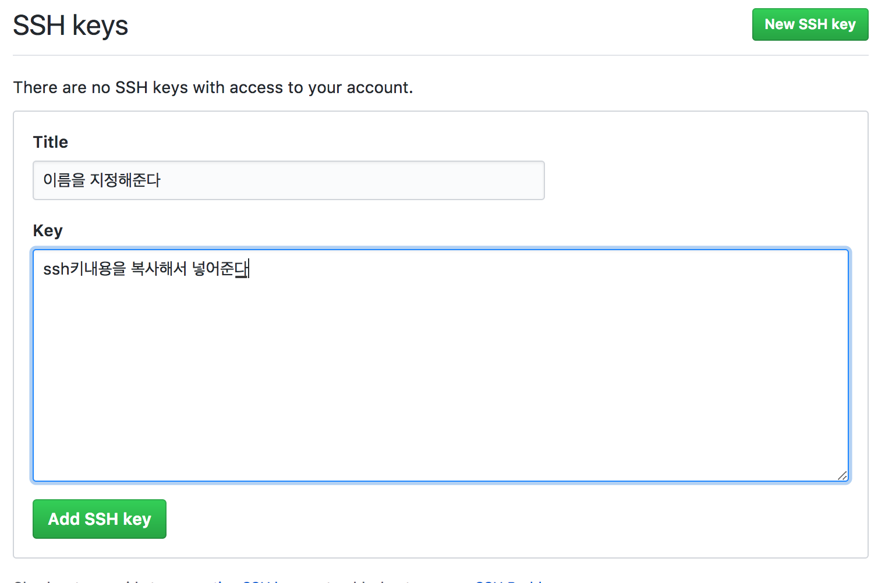

# Private Repo Clone 받지 못할 때 
## 문제 상황
우형 블로그에 테크캠프 계정으로 권한을 받았는데,
Git clone이 안됐다.
Ssh 문제인지 clone받는 방식의 문제인지는 모르겠다.


## ssh 설정 
[Git - 프로토콜](https://git-scm.com/book/ko/v2/Git-%EC%84%9C%EB%B2%84-%ED%94%84%EB%A1%9C%ED%86%A0%EC%BD%9C)

위 링크에 따르면, Git의 기본 프로토콜은 ssh이다. 
ssh의 가장 큰 특징은 인증 없이는 git repository에 접근이 불가능하도록 되어 있다는 점. 그리고 SSH는 사용자가 알아서 키를 만들고 공개키를 서버에 올린 후에야 비로소 인증을 받을 수 있다.

기존에 보통 이용해왔던 git 프로토콜 방식은 http으로 보인다.

맥에서 ssh key를 만드는 코드는 다음과 같다. 

```
ssh-keygen -t rsa -b 4096 -C "<github이메일>"
```

이걸 치고 나면 
다음과 같이 경로와 passphrase를 지정해주라고 나온다.
둘다 아무 것도 넣지 않아도 무방하다.


이제 
```
pbcopy < ~/.ssh/id_rsa.pub
# id_rsa.pub는 방금 생성된 키 이름, .ssh는 기본 경로이다. 
# 키와 경로이름에 따라 다를 수 있다. 
```

를 입력해서 ssh키의 내용을 복사한다.

다음은 github-Settings로 간다. 


New ssh key를 누르고, title은 자기가 원하는 대로, key에는 방금 복사한 내용을 붙여넣기 해준다.



## Git clone받기 
자, 현재 컴퓨터의 github계정이 어떻게 설정되어있는지 보자. 
```
git config --global --edit
# git global 계정을 설정한다.
```

name에는 github의 username, email에는 github의 email 계정이 들어가 있으면 된다. 물론 앞의 주석처리는 제외하고. 

이제 git clone을 받자.

```
git clone https://<유저네임>@github.com/<repo소유주>/<repo이름(.git)
``` 


## 결론 

방금 든 생각인데 어차피 http로 통신하는 거면 ssh 설정이 무의미했다는 생각이 든다. 하지만 ssh로 나중에 통신할 수 있게 설정되어서 이득. 